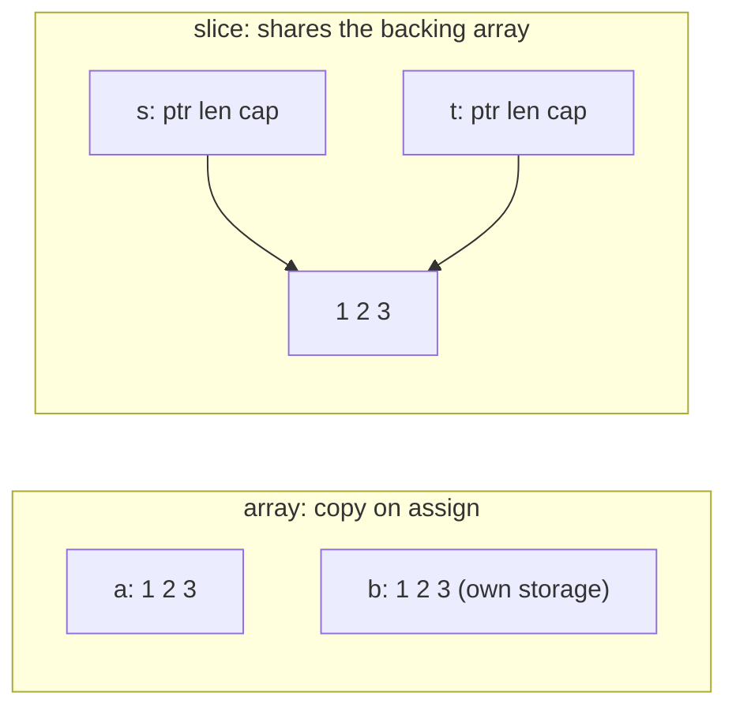

# Arrays

An array in Go is a fixed-length sequence whose **length is part of its type**.
`[3]int` and `[4]int` are two different types: a function taking one will not
accept the other, and there is no growing, appending, or resizing. Arrays are
also **values** — assigning one or passing it to a function copies every element.

That combination makes arrays rare in everyday Go. Slices, the next chapter, are
what you actually use. Arrays are worth understanding anyway, because every
slice is a window onto one, and because the value semantics that make arrays
awkward are exactly what make them useful in the few places they belong.

## 1. Declaring and indexing

```go
var a [3]int                       // zero valued: [0 0 0]
colors := [3]string{"red", "green", "blue"}
auto := [...]int{1, 2, 3}          // length inferred: [3]int
sparse := [5]int{2: 7}             // index 2 set, rest zero: [0 0 7 0 0]
```

Indexing is zero-based, so a length-3 array runs `a[0]`, `a[1]`, `a[2]` — the
last index is `len(a)-1`, which is `arrays1`'s whole point. Go checks bounds:
an index the compiler can see is out of range fails the build, and one it cannot
(a variable index) panics at run time with `index out of range [3] with length 3`
rather than reading someone else's memory.

`len(a)` is a compile-time constant for an array, because the length is in the
type.

## 2. One type, all the way down

```go
names := [4]string{"John", "Maria", "Carl", 10}   // does not compile
```

Every element has the element type — `arrays2` puts an untyped `10` where a
`string` belongs, and there is no coercion to save it. A collection of mixed
types needs `[]any` (and then type assertions to get anything back out), or, far
better, a struct with named fields.

## 3. Arrays are values, and that changes everything

```go
a := [3]int{1, 2, 3}
b := a          // full copy
b[0] = 99
// a is still [1 2 3]

func scale(arr [3]int) { arr[0] *= 2 }   // mutates the copy, not the caller's
```

```ascii
a := [3]int{1,2,3}      b := a          <- copies all 3 elements

  a: [ 1 ][ 2 ][ 3 ]      b: [ 1 ][ 2 ][ 3 ]
        (independent storage)

s := []int{1,2,3}       t := s          <- copies the header only

  s: ptr,len,cap ─┐
  t: ptr,len,cap ─┴─► [ 1 ][ 2 ][ 3 ]   <- shared backing array
```



This is the difference people trip over when they move on to slices, so it is
worth meeting here first: **an array copies, a slice shares.** Passing a large
array by value copies the whole thing on every call — pass `*[N]T` or use a
slice when that matters.

Two useful consequences of arrays being values: they are **comparable** with
`==` when their element type is (slices are not, and need `slices.Equal`), and
they can be **map keys** (slices cannot).

## 4. When to use an array

- A fixed-size buffer whose size is part of the contract: `[16]byte` for a
  digest, `[4]byte` for an IPv4 address.
- A value you want copied on assignment, or compared with `==`.
- A map key that groups several values.
- The backing store you slice from: `arr[:]` produces a slice over the array.

Everywhere else — anything that grows, anything read from input, anything
returned in an unknown quantity — the answer is a slice.

## Gotchas

- **`[3]int` and `[4]int` are different types.** A function cannot take "an
  array of ints" generically; that is what `[]int` is for.
- **The last index is `len-1`.** Off-by-one here is a compile error for constant
  indexes and a panic for variable ones.
- **Passing an array copies it.** Mutations inside the function are invisible
  outside.
- **`len` is fixed and known at compile time** — there is no `append` for
  arrays.
- **`arr[:]` shares**: the slice you take from an array points at that array's
  storage, so writing through the slice changes the array.

## The exercises

- **arrays1** — return the first and last elements of a `[3]string`; the last
  index is 2, not 3.
- **arrays2** — an array holds one element type; `10` cannot sit among strings.

## Source references

- [Go spec: Array types](https://go.dev/ref/spec#Array_types) ·
  [Index expressions](https://go.dev/ref/spec#Index_expressions)
- [Go blog: Arrays, slices (and strings)](https://go.dev/blog/slices) — the
  value-vs-view distinction, from the source
- [pkg.go.dev: slices.Equal](https://pkg.go.dev/slices#Equal)
- [A Tour of Go: Arrays](https://go.dev/tour/moretypes/6)

**Next: [slices](../slices/) →** — the growable view over an array, and the
header that makes it behave so differently.
