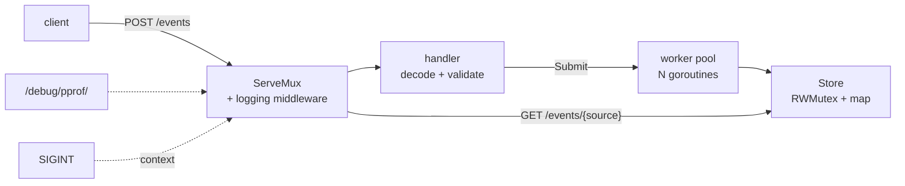

# Capstone — a concurrent log-ingest service

Every other topic in this curriculum drills one idea in isolation. The capstone
does the opposite: one program, built across eight stages, where each stage adds
a layer a real service actually needs and inherits every decision made before
it.

The service accepts log events over HTTP, validates them, batches them through a
worker pool, stores them safely under concurrent access, logs structurally,
shuts down without dropping work, parses an untrusted text format, and exposes
profiling endpoints.

These are also the only **package-mode** exercises in the repo: each stage spans
several files in a directory, golings compiles the whole directory, and the
earlier stages arrive already solved — so you can start at any stage, and reset
one without losing the rest.

## 1. The architecture, and how it grows



```ascii
                  ┌── middleware: slog + status capture
  POST /events ──►│  handler ──► jobs chan ──► worker 1 ─┐
                  │  (decode,                 worker 2 ─┼──► Store
  GET /events/… ──┤   validate)               worker 3 ─┘    (RWMutex)
                  └── /debug/pprof/                            ▲
                                                               │
  SIGINT ──► ctx cancel ──► Shutdown ──► drain pool ──► exit ──┘
```

Each stage is one layer of that picture:

| Stage | Adds | Chapters it draws on |
|---|---|---|
| **logingest1** | the `Event` model: struct tags, validation, a sentinel error, `%w` | structs · errors · stdlib_essentials |
| **logingest2** | a concurrency-safe `Store`: `RWMutex`, defensive copies | goroutine_safety · maps · slices |
| **logingest3** | the HTTP surface: `ServeMux` patterns, JSON in/out, status codes | http_server · errors |
| **logingest4** | a worker pool between handler and store | concurrency_patterns · channels |
| **logingest5** | cancellation and graceful shutdown | context · http_server_advanced |
| **logingest6** | `log/slog` and request-logging middleware | structured_logging · http_server |
| **logingest7** | parsing untrusted text, tested with fuzzing | strings · testing_advanced |
| **logingest8** | `net/http/pprof` on the service's own mux | profiling |

## 2. The decisions worth noticing

**Stage 1 — the model owns its validation.** `Event.Validate()` returns
`ErrInvalidEvent` wrapped with `%w`, so the handler can answer 400 with
`errors.Is` instead of matching strings. Validation living on the type is what
keeps every later layer from re-checking.

**Stage 2 — the store returns copies.** A method handing out its internal slice
would hand out the thing the lock protects; the reader would then race with a
writer holding the mutex and see the tear anyway. `RWMutex` because reads
dominate, and `slices.Clone` on the way out.

**Stage 3 — routing is the mux.** `"POST /events"` and `"GET /events/{source}"`
replace the `switch r.Method` plus `strings.Split(r.URL.Path, "/")` this used to
require, and `r.PathValue("source")` reads the segment.

**Stage 4 — the pool is backpressure, not speed.** A goroutine per request would
turn a burst of connections into a burst of goroutines all hitting one lock.
N workers draining one channel bounds the concurrency, and `Submit` stays safe
to call from every handler goroutine at once.

**Stage 5 — shutdown has a shape.** Cancel the context, stop accepting with
`srv.Shutdown`, *then* close the jobs channel and wait for the workers. Reverse
those and a worker sends on a closed channel or an in-flight request loses its
event. `http.ErrServerClosed` is the success path, not an error.

**Stage 6 — middleware sees what the handler wrote.** To log the status code you
wrap the `http.ResponseWriter` in a recorder type, because the real one will not
tell you. Attributes go in as key/value pairs, so the output is queryable.

**Stage 7 — untrusted input is where panics live.** A pipe-separated line with
three fields instead of four is a bad request, not a crash — the parser checks
counts before indexing, and the fuzz target proves it over generated input.

**Stage 8 — profiling is deliberate.** `net/http/pprof` registers on
`http.DefaultServeMux`; this service has its own, so the endpoints only appear
because the code forwards the prefix. That is exactly how it should be — an
accidental blank import should not publish debug endpoints.

## 3. How to work through it

```sh
mise run watch                      # the TUI, in curriculum order
./bin/golings run logingest4        # or one stage directly
./bin/golings reset logingest4      # restore a stage without touching the others
```

Each stage's directory holds the earlier stages' files marked *"Carried forward,
already solved. Read it, do not edit it."* Read them — the point is to see the
layer you are adding fit against the ones already there — and edit only what the
`FIXME` names.

Every stage's tests run with `-race`, and `golangci-lint` must be clean before a
stage counts as done, so the concurrency has to be genuinely correct rather than
merely passing once.

## Gotchas

- **Do not edit the carried-forward files.** A stage's tests assume them.
- **Shutdown order matters**: stop accepting, drain, then close.
- **Never hand out the slice the lock protects** — clone it.
- **`errors.Is` needs `%w`** all the way up; one `%v` and the 400 becomes a 500.
- **Set headers before writing**, and `return` after `http.Error`.
- **A worker pool with an unbuffered jobs channel applies backpressure** — that
  is the feature, not a bug to buffer away.
- **`-race` is not optional here.** Four of the eight stages are concurrent.

## The exercises

- **logingest1** — the `Event` model, tags, and a wrapped sentinel error.
- **logingest2** — a `RWMutex`-guarded store that returns copies.
- **logingest3** — method + wildcard routing with JSON encode/decode.
- **logingest4** — a fixed worker pool behind the handler.
- **logingest5** — context cancellation and graceful shutdown.
- **logingest6** — `slog` and request-logging middleware.
- **logingest7** — a text parser hardened against untrusted input, fuzzed.
- **logingest8** — `net/http/pprof` on the service's own mux.

## Source references

- [pkg.go.dev: net/http](https://pkg.go.dev/net/http) ·
  [log/slog](https://pkg.go.dev/log/slog) ·
  [sync.RWMutex](https://pkg.go.dev/sync#RWMutex) ·
  [net/http/pprof](https://pkg.go.dev/net/http/pprof)
- [Go blog: Pipelines and cancellation](https://go.dev/blog/pipelines) ·
  [Working with Errors](https://go.dev/blog/go1.13-errors) ·
  [Routing enhancements](https://go.dev/blog/routing-enhancements)
- [pkg.go.dev: Server.Shutdown](https://pkg.go.dev/net/http#Server.Shutdown)
- [Go: Fuzzing tutorial](https://go.dev/doc/tutorial/fuzz)

**End of the curriculum.** The service you finish with is small, but nothing in
it is a toy: the same shapes — validate at the edge, bound your concurrency,
log structurally, shut down cleanly, profile deliberately — are what production
Go services are made of.
