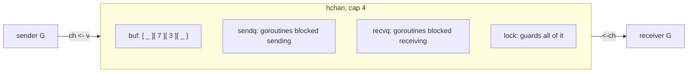

# Channels

A channel is a typed pipe with a lock and a queue inside it. `chan int` carries
ints and nothing else; one goroutine puts values in with `ch <- v`, another takes
them out with `<-ch`, and the runtime makes that exchange safe without you
writing a mutex. The arrow always points the way the value moves.

The part worth internalising is that a channel is not only a container — it is a
**synchronization point**. A send on an unbuffered channel does not finish until
a receiver takes the value, so the two goroutines meet at that line. Buffering
loosens the meeting; direction (`chan<- T`, `<-chan T`) documents who is allowed
to do which half. These two exercises drill both.

## 1. What is inside a channel

`make(chan T, n)` allocates an `hchan`: a ring buffer of `n` slots, a send index
and a receive index, a queue of goroutines parked on send, a queue parked on
receive, and a mutex guarding all of it. Channel operations are not lock-free —
they take that mutex, do a few pointer moves, and release it.



```ascii
hchan, cap 4

  buf    [ _ ][ 7 ][ 3 ][ _ ]
                ^recvx    ^sendx
  sendq  G5 -> G9    blocked senders (buffer full)
  recvq  (empty)     blocked receivers
  lock               guards all of the above
```

The unbuffered case is the interesting one: with no buffer there is nothing to
copy *into*, so the runtime copies the value **straight from the sender's stack
to the receiver's stack** and wakes it. No intermediate storage, one copy, and
both goroutines know the other reached the meeting point.

## 2. Unbuffered: a rendezvous

```go
ch := make(chan int)   // capacity 0
ch <- 42               // blocks until someone receives
```

A send blocks until a receiver arrives; a receive blocks until a sender arrives.
Whoever gets there first parks in `sendq`/`recvq`, and the second one hands the
value over directly.

This is why `channels1` deadlocks as written: a single goroutine sends into an
unbuffered channel with no receiver anywhere, so it parks forever and the runtime
notices that *every* goroutine is asleep:

```
fatal error: all goroutines are asleep - deadlock!
```

That message is the runtime's deadlock detector, and it only fires when nothing
at all can run. A subset of stuck goroutines while `main` keeps working is a
silent leak, not a fatal error.

## 3. Buffered: a queue with a ceiling

```go
ch := make(chan int, 3)
```

Now a send succeeds immediately while the buffer has room, and only blocks when
it is full. A receive succeeds while the buffer has values, and only blocks when
it is empty. `channels1` fixes its deadlock by sizing the buffer to hold every
value the loop sends.

Buffer capacity is a **backpressure knob**, not a performance dial. Ask what
should happen when the consumer falls behind:

| Capacity | Behaviour | Use when |
|---|---|---|
| `0` | sender waits for receiver | you want lock-step handoff, or a signal |
| small `n` | absorbs bursts, then pushes back | producer and consumer are roughly matched |
| huge `n` | producer never waits | almost never — it hides the imbalance and buys latency with memory |

A too-large buffer does not make a slow consumer fast; it just delays the moment
you find out.

## 4. Closing, and the three special states

`close(ch)` means *no more values will ever be sent*. It is not cleanup — a
channel nobody references is garbage-collected whether or not it was closed.
Close only when receivers need to know the stream ended:

```go
for v := range ch { … }   // ends when ch is closed
v, ok := <-ch             // ok == false once drained and closed
```

Three states catch people out:

- **Closed channel**: receives drain the buffer, then return the zero value with
  `ok == false`, forever. A send **panics**. A second `close` **panics**.
- **`nil` channel** (declared, never `make`d): every send and receive blocks
  forever. Not a bug in itself — it is the idiom for switching a `select` case
  off, which the next chapter uses.
- **Zero value, `ok == false`**: a receive that returns `0` may mean "someone
  sent 0" or "the channel is closed". Only the comma-ok form tells them apart.

Because a close is a promise about sends, the rule that follows is ownership:
**the sender closes, exactly once, and receivers never do.** `safety3` in the
`goroutine_safety` chapter is that rule as a crash.

## 5. Direction: `chan<- T` and `<-chan T`

A bidirectional `chan T` converts implicitly to either restricted form, and never
back:

```go
func produce(out chan<- int, n int) { … ; close(out) }  // send-only
func consume(in <-chan int) []int   { for v := range in … } // receive-only
```

The compiler now enforces the roles: `consume` cannot send and cannot `close`,
`produce` cannot receive. This is free documentation — the signature says which
end of the pipe you are holding — and it turns the "only the owner closes" rule
from a convention into a build error. Take channel parameters in their
directional form by default; return `<-chan T` from a function that spawns a
producer, as the pipeline stages in `concurrency_patterns` do.

## Gotchas

- **`range ch` never ends unless someone closes `ch`.** The loop is not "until
  empty", it is "until closed".
- **Closing does not cancel.** Values already buffered are still delivered.
  Use `context` to stop work early, not `close`.
- **`len(ch)` and `cap(ch)`** report buffered values and capacity, and are stale
  the moment they return. Never branch on `len(ch)`; use a `select` with
  `default`.
- **A send on a full channel with no live receiver is a leak**, and one of the
  most common goroutine leaks in production Go: the consumer returned early,
  the producer is parked in `sendq` forever.
- **Struct-typed channels copy the value**, like everything else in Go. Sending
  a large struct copies it twice (in and out); send a pointer if that matters —
  and then remember the receiver, not the sender, owns what it points at.

## The exercises

- **channels1** — a single goroutine sends three values before draining them.
  Size the buffer so the sends do not deadlock, and see why `close` is required
  before `range`.
- **channels2** — split a producer and a consumer across directional types, and
  let the compiler prove that only the producer can close.

## Source references

- [Go spec: Channel types](https://go.dev/ref/spec#Channel_types) ·
  [Send statements](https://go.dev/ref/spec#Send_statements) ·
  [Receive operator](https://go.dev/ref/spec#Receive_operator)
- [The Go Memory Model: channel communication](https://go.dev/ref/mem#chan) —
  the send *happens before* the receive completes; the close *happens before* a
  receive that returns zero
- [`src/runtime/chan.go`](https://github.com/golang/go/blob/master/src/runtime/chan.go)
  — `hchan`, `chansend`, `chanrecv`, and the direct sender→receiver copy
- [Go blog: Share Memory By Communicating](https://go.dev/blog/codelab-share)
- [A Tour of Go: Buffered Channels](https://go.dev/tour/concurrency/3)

**Next: [select](../select/) →** — waiting on several channels at once, adding a
timeout, and refusing to wait at all.
