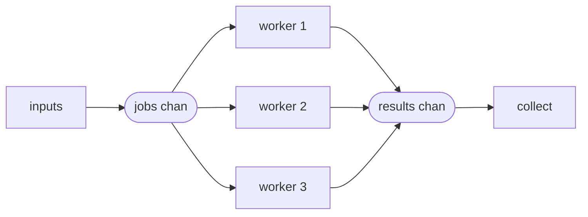
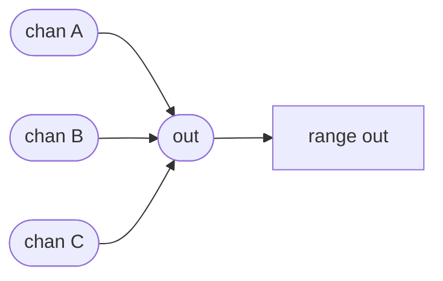
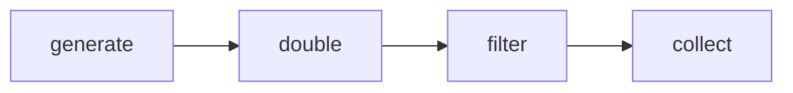

# Concurrency patterns

Goroutines, channels, `select` and `context` are four small parts, and nearly all
concurrent Go is three arrangements of them: spread work across N workers
(**worker pool**), collapse N streams into one (**fan-in**), and chain stages
that each transform a stream (**pipeline**).

They share one skeleton — a goroutine that ranges over an input channel, sends to
an output channel, and closes what it owns — so the interesting part is never the
mechanics. It is the two questions every arrangement has to answer: *who closes
the output*, and *what happens when the consumer stops early*.

## 1. Worker pool: bounded parallelism



```ascii
inputs -> jobs -+-> worker 1 -+-> results -> collect
    (1 chan)    +-> worker 2 -+   (buffered)
                +-> worker 3 -+
```

One `jobs` channel, N goroutines ranging over it, one `results` channel. The
channel does the load balancing for free: a worker that finishes early comes back
for another job, so a slow item does not idle the others — no queue assignment,
no work stealing, no size negotiation.

```go
for i := 0; i < workers; i++ {
    wg.Add(1)
    go func() {
        defer wg.Done()
        for j := range jobs {        // ends when jobs is closed
            results <- j * j
        }
    }()
}
go func() { for _, n := range inputs { jobs <- n }; close(jobs) }()

wg.Wait()        // all workers returned...
close(results)   // ...so nobody can send on results any more
```

The ordering at the bottom is the whole pattern. `close(jobs)` is what ends the
`range` in every worker; `wg.Wait()` is what proves no worker will send again;
only then is `close(results)` safe. Close it earlier and a worker panics on a
send to a closed channel.

N is a real decision. For CPU-bound work, `runtime.GOMAXPROCS(0)` is the sane
default — more goroutines than cores just adds scheduling. For I/O-bound work,
N is a **concurrency limit on the thing you are calling**: it is how you avoid
opening 10 000 sockets against a service that tolerates 50. The pool is
backpressure, not speed.

`concpat1` buffers `results` to `len(inputs)` so collection can happen after
`wg.Wait()`. That is fine for a bounded batch; for a stream you would instead
collect concurrently and close `results` from a separate goroutine — see fan-in.

## 2. Fan-in: many producers, one channel



```ascii
chan A -+
chan B -+-> out -> range out
chan C -+
```

One goroutine per input copies values into a shared `out`. The problem is
closing it: each copier knows when *its* input ended, none knows when the last
one did. A `WaitGroup` plus a closer goroutine answers that:

```go
func merge(chans ...<-chan int) <-chan int {
    out := make(chan int)
    var wg sync.WaitGroup

    for _, c := range chans {
        wg.Add(1)
        go func() {
            defer wg.Done()
            for v := range c { out <- v }
        }()
    }
    go func() { wg.Wait(); close(out) }()   // closer, not a caller

    return out
}
```

The closer must be its own goroutine: `merge` has to return `out` immediately so
the caller can start receiving, and `wg.Wait()` cannot finish until it does.
Note also the return type — `<-chan int`, receive-only. The function that creates
a channel owns it, and handing back a restricted type makes it impossible for the
caller to close it.

Output order is **not** input order and never will be: three copiers race, and a
`select` between ready channels is random by design. If order matters, fan-in is
the wrong shape — index the results and sort, as `concpat1`'s test does.

## 3. Pipeline: stages joined by channels



```ascii
generate -> double -> filter -> collect
```

Each stage is a function that takes a receive-only channel, returns a
receive-only channel, and runs one goroutine that ranges over its input, sends
transformed values, and closes its output on the way out:

```go
func double(in <-chan int) <-chan int {
    out := make(chan int)
    go func() {
        defer close(out)          // this stage owns out; close it exactly once
        for v := range in {
            out <- v * 2
        }
    }()
    return out
}
```

Because each stage closes its own output, the close cascades: the generator ends,
its `range` ends in `double`, `double` closes, and the shutdown ripples to the
collector without any coordination. Composition is just nesting —
`double(generate(1,2,3))` — and unbuffered channels make each stage run only as
fast as the next one consumes, which is backpressure you get for free.

## 4. The leak all three share

Every pattern above assumes the consumer drains to the end. Stop early and the
producers are still parked on a send nobody will receive:

```go
for v := range double(generate(nums...)) {
    if v > 4 { break }   // ← the stage goroutine is now blocked forever
}
```

This is *the* Go goroutine leak. Nothing crashes, nothing is reported; the
goroutine, its stack, and everything it references stay alive for the life of the
process. The fix is a cancellation channel every stage selects on — which is
exactly what `context` is:

```go
func double(ctx context.Context, in <-chan int) <-chan int {
    out := make(chan int)
    go func() {
        defer close(out)
        for v := range in {
            select {
            case out <- v * 2:
            case <-ctx.Done():
                return          // consumer gave up; unwind
            }
        }
    }()
    return out
}
```

Take a `ctx` in every stage, `defer cancel()` in the caller, and the whole
pipeline unwinds when the consumer leaves. For a pool where any worker's error
should cancel the rest, `golang.org/x/sync/errgroup` packages the group, the
context, and the first error together.

## Gotchas

- **Close the output from whoever owns it, exactly once.** Producers close;
  consumers never do. Directional return types (`<-chan T`) make that a compile
  error rather than a rule.
- **`close(results)` before `wg.Wait()`** panics as soon as a straggler sends.
- **Unbuffered stages give you backpressure; buffered ones hide it.** Reach for
  a buffer to absorb a burst, not to make a slow stage look fast.
- **Ranging over an input you did not create is fine; closing it is not.**
- **A pipeline with no cancellation is a leak waiting for its first `break`** —
  including the `break` inside the caller's error path that you have not written
  yet.
- **`wg.Add` goes outside the goroutine**, always (or use `wg.Go`, Go 1.25).

## The exercises

- **concpat1** — worker pool: implement the worker so N goroutines drain one
  jobs channel, and see why `close(results)` has to follow `wg.Wait()`.
- **concpat2** — fan-in: merge several channels into one, with a closer
  goroutine that waits for every copier.
- **concpat3** — pipeline: write a stage that ranges its input, emits, and
  closes its own output so the shutdown cascades.

## Source references

- [Go blog: Pipelines and cancellation](https://go.dev/blog/pipelines) — the
  canonical treatment, including the early-exit leak
- [Go blog: Go Concurrency Patterns (Rob Pike)](https://go.dev/talks/2012/concurrency.slide)
- [pkg.go.dev: errgroup](https://pkg.go.dev/golang.org/x/sync/errgroup) — pool +
  context + first error
- [Go by Example: Worker Pools](https://gobyexample.com/worker-pools)
- [pkg.go.dev: runtime.GOMAXPROCS](https://pkg.go.dev/runtime#GOMAXPROCS)

**Next: [goroutine_safety](../goroutine_safety/) →** — the ownership rules that
keep these patterns from leaking or panicking, under the race detector.
