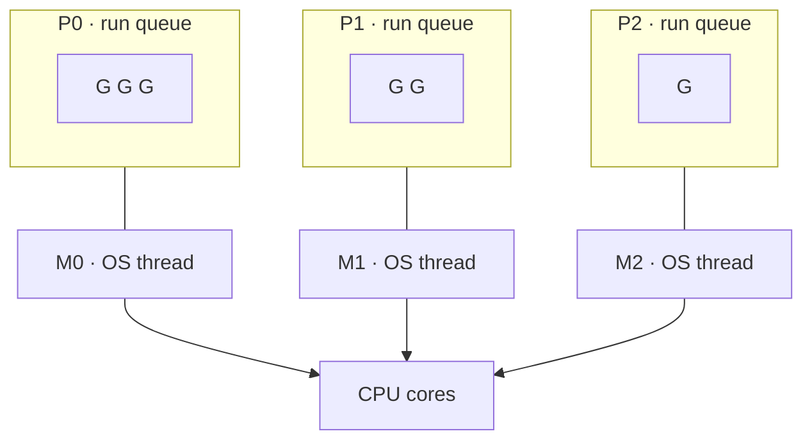

# Concurrency (goroutines)

A goroutine is a function that runs while the rest of your program keeps going.
You start one by putting `go` in front of a call, and that is the whole syntax —
there is no thread object to configure, no pool to size, no future to hold.
What you give up is control: the caller does not know when the goroutine runs,
whether it has finished, or what it saw when it read a variable you were writing.

Everything else in this series exists to buy that control back. `sync.WaitGroup`
answers *are they done*, channels answer *how do I hand a value over*, mutexes
answer *who may touch this memory*, and `context` answers *how do I tell them to
stop*. These three exercises cover the first two, and deliberately walk into the
data race that motivates the rest.

## 1. What `go f()` actually costs

A goroutine is not an OS thread. The runtime allocates a small `g` struct and a
**2 KB stack**, then hands it to the scheduler; an OS thread starts at 1–8 MB of
stack plus kernel bookkeeping. That is why a Go program can hold hundreds of
thousands of goroutines and a thread-per-request program cannot.

The stack is small because it grows on demand: when a function call would
overflow it, the runtime allocates a bigger stack, copies the old one over, and
rewrites the pointers into it. Goroutine stacks are therefore not stable
addresses — a good reason not to reason about them at all.

Scheduling is the GMP model: **G** goroutines are queued on **P** processors
(`GOMAXPROCS` of them, one per CPU by default), and **M** OS threads execute
them. A goroutine that blocks on a channel or a mutex parks and its M picks up
another G; a goroutine that blocks in a syscall hands its P to another M. Nothing
about this is visible to you, which is the point.



```ascii
GOMAXPROCS=4

  P0 [G G G]  P1 [G G]  P2 [G]  P3 [G G G]   run queues
   |           |         |       |
  M0          M1        M2      M3           OS threads
   +-----------+---------+-------+
              4 CPU cores
```

## 2. `go` starts it, nothing waits for it

`go f()` returns immediately. If `main` returns while goroutines are still
running, the process exits and takes them with it — no panic, no message, just
missing output. `concurrent1` fails exactly this way if you delete the
`WaitGroup`.

There is no goroutine handle, no join, no id. If you want to know that work
finished, you must arrange the signal yourself: a `WaitGroup`, a channel, or a
`done` closure. This is the single most common source of "my test passes locally
and fails in CI" — the test was reading a value the goroutine had not written
yet.

## 3. WaitGroup: counting the unfinished

`sync.WaitGroup` is a counter plus a parking lot:

```go
var wg sync.WaitGroup
for i := 0; i < 3; i++ {
    wg.Add(1)              // counter++  (before the go statement)
    go func() {
        defer wg.Done()    // counter--  (always, even on panic)
        work(i)
    }()
}
wg.Wait()                  // parks until counter == 0
```

`Add` and `Done` are atomic adds on one word; `Wait` parks the calling goroutine
on a semaphore, and the `Done` that drops the counter to zero wakes everyone
waiting. Nothing spins.

Two rules follow from the counter being a plain number:

- **`Add` before `go`, never inside it.** `go func() { wg.Add(1); … }()` races
  with `Wait` — the counter may still be zero when `Wait` runs, so `Wait`
  returns and the goroutine keeps writing to memory nobody is guarding.
- **`defer wg.Done()` as the first line of the goroutine.** Then an early
  `return`, a `t.Fatal`, or a panic still decrements it. A missed `Done` means
  `Wait` blocks forever: `all goroutines are asleep - deadlock!`

Since Go 1.25 the whole pattern has a shorthand — `wg.Go(func(){ … })` does the
`Add(1)`, the `go`, and the `defer Done()` in one call. The `goroutine_safety`
exercises use it; these three spell it out so you can see the counter.

## 4. The race the exercises walk you into

`concurrent2` starts 100 goroutines that each run `counter++` and expects 100.
It does not get 100, because `++` is three machine steps — load, add, store —
and two goroutines that load the same value both store the same result. One
increment vanishes. Nothing crashes; the number is quietly wrong, which is worse.

The tool that makes this visible is the race detector:

```sh
go test -race ./...      # `mise run test` already does this
```

It instruments every memory access and reports the two goroutines, the address,
and both stacks. **A concurrent test that has never been run under `-race` has
not been tested.** Take the flag seriously the moment you write your first `go`
statement — the `sync` chapter is about the tools that make the report go away,
but the flag is what tells you a tool is needed at all.

`concurrent3` shows the other answer, the one Go is designed around: instead of
two goroutines sharing a variable, one sends the value and the other receives it.
The handoff *is* the synchronization, and there is no shared state left to guard.

## Gotchas

- **A goroutine that outlives its purpose is a leak.** It holds its stack and
  everything it references until it returns. Blocked forever on a channel
  nobody sends to, it is invisible until the heap grows.
- **Loop variables were a trap until Go 1.22.** Before it, every iteration
  shared one `i` and all goroutines usually saw the last value, so the fix was
  `go func(i int){…}(i)`. Since 1.22 each iteration gets a fresh variable and
  the plain closure is correct. This repo is on Go 1.26; the argument-passing
  form still works and is harmless, but it is no longer required.
- **Never copy a `WaitGroup`.** Pass `*sync.WaitGroup`. A copy has its own
  counter, so `Done` on it decrements nothing that `Wait` is watching. `go vet`
  catches most of these.
- **Reusing a `WaitGroup`** is legal only after `Wait` returns; calling `Add`
  concurrently with `Wait` is not.
- **Output order is not a bug.** Goroutine scheduling is not deterministic, so
  `concurrent1` may print 2, 0, 1. Only assert on the set, never the order.

## The exercises

- **concurrent1** — start three goroutines, guard the shared `bytes.Buffer`
  with a mutex, and wait for all three with a `WaitGroup`.
- **concurrent2** — 100 goroutines increment one counter. Make the total
  correct; run it with `-race` first to see the failure named.
- **concurrent3** — hand values between goroutines over a channel instead of
  sharing them: send, `close`, and range to receive until closed.

## Source references

- [The Go Memory Model](https://go.dev/ref/mem) — what "happens before" means, and
  the guarantees `go`, channels, and `sync` actually give you
- [Effective Go: Concurrency](https://go.dev/doc/effective_go#concurrency)
- [Go spec: Go statements](https://go.dev/ref/spec#Go_statements)
- [pkg.go.dev: sync.WaitGroup](https://pkg.go.dev/sync#WaitGroup) ·
  [`WaitGroup.Go`](https://pkg.go.dev/sync#WaitGroup.Go) (Go 1.25)
- [Data Race Detector](https://go.dev/doc/articles/race_detector)
- [A Tour of Go: Goroutines](https://go.dev/tour/concurrency/1)

**Next: [channels](../channels/) →** — the handoff `concurrent3` used, with its
buffering and direction rules made explicit.
