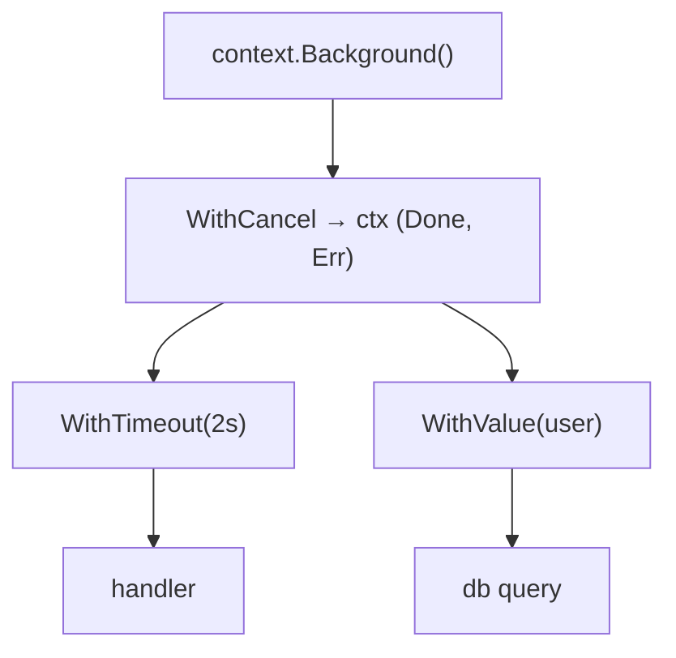

# Context

`select2` gave up waiting after a timeout, but the work on the other side of the
channel carried on: the query still ran, the connection stayed open, the
goroutine still finished into a result nobody read. Abandoning a result is not
cancellation.

`context.Context` is how a cancellation signal travels *into* the work. It is an
immutable value you pass as the first argument of every call that might block,
carrying three things: a `Done()` channel that closes when the caller gives up,
an `Err()` saying why, and an optional deadline. Everything below the caller —
your own goroutines, `database/sql`, `net/http`, gRPC — watches that one channel,
so one `cancel()` unwinds the whole tree.

## 1. The tree, and how a cancel propagates

Contexts are built by derivation. Each `With…` call wraps a parent and returns a
child plus a `cancel` function:

```go
ctx, cancel := context.WithCancel(context.Background())
defer cancel()
```



```ascii
context.Background()
  |
  +-- WithCancel -> ctx (Done chan, Err)
        |
        +-- WithTimeout(2s) -> handler
        +-- WithValue(user) -> db query
```

Internally a `cancelCtx` holds a set of its children. `cancel()` closes its own
`Done` channel, records the reason in `Err`, then walks that set cancelling each
child, depth first. Cancellation flows **down** only — cancelling a child never
touches the parent — and a child is also cancelled when its parent is. Once
cancelled, a context stays cancelled; there is no reset.

`Background()` is the root: never cancelled, no deadline, no values. `TODO()` is
the same thing with a different message to the reader — "a context belongs here
and I have not wired it yet".

## 2. Watching `Done()`

A context is only as good as the code that checks it. There are two shapes.

**Blocking work** puts `ctx.Done()` in the `select` alongside the real work —
this is `context1` and `context2`:

```go
select {
case res := <-work:
    return res, nil
case <-ctx.Done():
    return zero, ctx.Err()
}
```

**CPU-bound loops** have nothing to block on, so they poll between chunks:

```go
for _, item := range items {
    if err := ctx.Err(); err != nil {
        return err
    }
    process(item)
}
```

`Done()` returns a receive-only channel that is **closed**, not sent to — which
is why every watcher is released at once and why re-receiving keeps returning
immediately. A `nil`-returning `Done()` (as `Background()` gives) blocks forever
in a `select`, which is exactly the "never cancelled" behaviour you want.

## 3. Deadlines are cancels with a timer

`WithTimeout(parent, d)` is `WithDeadline(parent, time.Now().Add(d))`, and a
`timerCtx` is a `cancelCtx` with a `time.AfterFunc` that calls its own cancel.
So a timeout produces the same `Done()` close as a manual cancel — only `Err()`
tells them apart:

- `context.DeadlineExceeded` — the timer fired.
- `context.Canceled` — someone called `cancel()`.

Compare with `errors.Is(err, context.DeadlineExceeded)`, not `==`, since the
error is usually wrapped by the time it reaches you. Both satisfy the
`net.Error` timeout interface, which is why an HTTP client returns "context
deadline exceeded" for a slow server.

**Always `defer cancel()`, even on a `WithTimeout`.** The `cancel` releases the
timer and detaches the child from the parent's children set immediately. Skipping
it keeps the child (and everything it references) alive until the deadline
passes; `go vet`'s `lostcancel` check exists precisely because this leak is easy
to write and invisible to test.

A derived deadline can only shorten, never extend: `WithTimeout(ctx, time.Hour)`
on a context with 5 seconds left still fires in 5 seconds.

## 4. Values: request scope only

```go
type ctxKey string
const userKey ctxKey = "user"

ctx := context.WithValue(ctx, userKey, "alice")

user, ok := ctx.Value(userKey).(string)   // comma-ok — it may be absent
```

`WithValue` prepends one immutable key/value node to the chain, and `Value`
walks the chain up to the root comparing keys with `==`. That has two
consequences: lookup is linear in chain depth (fine for a handful of values,
not a store), and the key's *type* is part of the comparison.

Use an **unexported named type** for keys, as `context3` does. A `string` key
collides with any other package that happened to pick `"user"`; an unexported
`ctxKey` cannot be constructed outside your package, so collision is impossible.

What belongs there: request-scoped data that crosses API boundaries and that
middleware — not the caller — supplies. Trace and request ids, the authenticated
user, a logger. What does not: anything the function needs to do its job. Those
are parameters. A function whose behaviour depends on values you cannot see in
its signature is a function nobody can call correctly.

Since Go 1.21, `context.WithoutCancel`, `WithDeadlineCause` and `AfterFunc` cover
the awkward cases — detaching a background write from a request that is about to
end, or attaching a reason to a cancellation (`context.Cause(ctx)`).

## Gotchas

- **`ctx` is the first parameter, named `ctx`, never stored in a struct.** The
  exception (a struct that *is* a request, like `http.Request`) uses `WithContext`
  and returns a copy.
- **Never pass a `nil` context.** Pass `context.TODO()` while wiring things up.
- **Cancellation is cooperative.** Nothing in the runtime stops a goroutine; a
  loop that never checks `ctx` runs to completion no matter how many cancels
  fire.
- **A cancelled context poisons everything derived from it.** Deriving a fresh
  timeout from a cancelled parent gives an already-cancelled child — the reason
  `WithoutCancel` exists.
- **Do not use `Done()` as a general event bus.** One close, one direction, one
  meaning: stop.

## The exercises

- **context1** — return from a loop when `ctx.Done()` closes, driven by a
  `WithCancel` from another goroutine.
- **context2** — race work against a `WithTimeout` deadline and return
  `ctx.Err()`, distinguishing `DeadlineExceeded` from `Canceled`.
- **context3** — read a request-scoped value back out with a collision-proof
  unexported key type and a comma-ok assertion.

## Source references

- [Go blog: Go Concurrency Patterns: Context](https://go.dev/blog/context) — the
  original design rationale
- [`src/context/context.go`](https://github.com/golang/go/blob/master/src/context/context.go)
  — `cancelCtx.children`, `propagateCancel`, and `timerCtx`
- [pkg.go.dev: context](https://pkg.go.dev/context) ·
  [`WithoutCancel`](https://pkg.go.dev/context#WithoutCancel) ·
  [`Cause`](https://pkg.go.dev/context#Cause)
- [Go Wiki: Contexts and structs](https://go.dev/blog/context-and-structs) — why
  `ctx` is an argument, not a field
- [`go vet` lostcancel check](https://pkg.go.dev/cmd/vet)

**Next: [concurrency_patterns](../concurrency_patterns/) →** — goroutines,
channels, `select` and `context` assembled into the three shapes you will
actually reach for.
