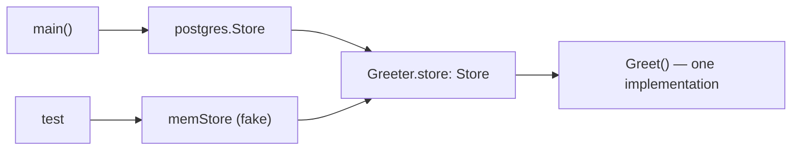

# Dependency injection

Dependency injection sounds like a framework and is actually a habit: a function
or type receives its collaborators instead of reaching out for them. In Go it
needs no container, no annotations, and no code generation — a parameter and an
interface are the whole mechanism.

The reason to care is not architectural purity. It is that code which calls
`os.Stdout`, `time.Now()`, or a database handle directly cannot be tested
without providing a real one. Inject those and the same code runs against a
`bytes.Buffer`, a fixed clock, and an in-memory store.

## 1. Inject the collaborator, not the concrete thing

```go
// hard to test — the destination is baked in
func Greet(name string) {
    fmt.Printf("Hello, %s!\n", name)
}

// testable — the destination is a parameter
func Greet(w io.Writer, name string) {
    fmt.Fprintf(w, "Hello, %s!", name)
}
```

That is `di1`, and it is the smallest possible example of the whole idea.
Production passes `os.Stdout`; a test passes `&bytes.Buffer{}` and asserts on
what was written; an HTTP handler passes the `http.ResponseWriter`. One function,
three destinations, no branching on which.

`io.Writer` is worth studying as the model constraint: one method, defined by the
standard library, satisfied by files, buffers, network connections, gzip
wrappers, and `httptest` recorders. Depending on it costs nothing and buys all of
them.

## 2. Wrap the un-testable: clocks, randomness, IDs

Some dependencies are invisible because they are package-level functions:

```go
type Clock interface {
    Now() time.Time
}

func Greeting(c Clock) string {
    if c.Now().Hour() < 12 {
        return "Good morning"
    }
    return "Good evening"
}
```

`di2`. Calling `time.Now()` directly makes the function's behaviour depend on
when the test runs — a suite that passes all morning and fails after lunch. With
a `Clock` parameter, the test injects `fixedClock{t: …}` and pins the hour.

The same treatment applies to `rand`, UUID generation, `os.Getenv`, and anything
else non-deterministic. The interface stays tiny — one method — and the
production implementation is usually three lines:

```go
type realClock struct{}
func (realClock) Now() time.Time { return time.Now() }
```

(For *time-dependent concurrency*, Go now has a better answer than injecting a
clock: `testing/synctest` runs the real `time` package against a fake clock —
see the `synctest` chapter. Injection still wins for simple "what hour is it"
logic.)

## 3. Constructor injection for types

When a dependency is used by several methods, hold it in the struct and supply
it at construction:

```go
type Store interface {
    Save(name string)
    Count() int
}

type Greeter struct {
    store Store            // the dependency, as an interface
}

func NewGreeter(s Store) *Greeter { return &Greeter{store: s} }

func (g Greeter) Greet(name string) string {
    g.store.Save(name)
    return "Hi, " + name
}
```

`di3`. The wiring happens once, in `main` or in a test, and every method gets it
for free.

```ascii
main()                        test
  db := postgres.New(...)       store := &memStore{}
  g  := NewGreeter(db)          g := Greeter{store: store}
        │                             │
        └──► Greeter.store ◄──────────┘
             (same code path, different collaborator)
```



The struct field is the **interface**, not the concrete type. That is the line
that makes the substitution possible, and the one people forget.

## 4. Where the interface belongs

Go's convention runs opposite to most languages: **define the interface in the
package that consumes it**, not the one that implements it.

```go
// package greeter — declares what it needs
type Store interface{ Save(name string); Count() int }

// package postgres — returns a concrete *DB, mentions no interface
func New(dsn string) *DB
```

"Accept interfaces, return structs." The consumer's interface lists only the
methods it actually uses, so it stays small, and the implementation is free to
have fifty other methods without anyone depending on them.

The corollary: **do not create an interface until you have a second
implementation** — and a test double counts. A one-method interface with one
implementation and no fake is ceremony.

## 5. Functions are dependencies too

For a single-method dependency, a function parameter is often lighter than an
interface:

```go
func Greeting(now func() time.Time) string { … }

Greeting(time.Now)                                   // production
Greeting(func() time.Time { return fixed })          // test
```

No type declaration, no implementation struct. `http.HandlerFunc` and
`sort.Slice` are the standard library making the same choice. Use an interface
when the dependency has two or more methods, or when its name documents a
concept worth having.

## Gotchas

- **Injecting the concrete type** (`store *postgres.DB`) buys nothing — the
  field's type has to be the interface.
- **Interfaces defined next to the implementation** grow to mirror it, which is
  how five-method interfaces appear.
- **Constructors that reach out** — `NewGreeter()` calling `postgres.New()`
  internally — are the problem being solved, wearing a constructor's clothes.
- **`time.Now()` inside business logic** makes tests time-of-day dependent.
- **Global state is injection's opposite.** A package-level `var db *sql.DB` is
  a dependency nobody can substitute.
- **Do not inject everything.** `fmt`, `strings`, and pure helpers have no
  reason to be swappable.

## The exercises

- **di1** — take an `io.Writer` so a test can capture the output in a buffer.
- **di2** — hide `time.Now()` behind a one-method `Clock` and inject a fixed one.
- **di3** — hold a `Store` interface in a struct and delegate to it.

## Source references

- [Go Code Review Comments: interfaces](https://go.dev/wiki/CodeReviewComments#interfaces)
  — "accept interfaces, return structs", from the source
- [Effective Go: Interfaces](https://go.dev/doc/effective_go#interfaces)
- [pkg.go.dev: io.Writer](https://pkg.go.dev/io#Writer) — the model dependency
- [Learn Go with Tests: Dependency Injection](https://quii.gitbook.io/learn-go-with-tests/go-fundamentals/dependency-injection)

**Next: [mocking](../mocking/) →** — what you actually pass in during the test,
and the two shapes those doubles take.
