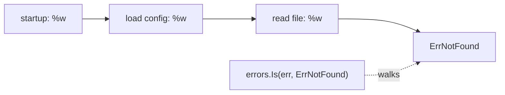

# Errors

Go has no exceptions. A function that can fail returns an `error` as its last
result, and the caller decides what to do with it on the very next line. That is
the whole model, and the `if err != nil` blocks it produces are the most
recognisable thing about the language.

The type behind it is tiny:

```go
type error interface {
    Error() string
}
```

Anything with an `Error() string` method is an error. Everything else — the
sentinels, the wrapping, `Is`, `As`, `Join` — is convention and standard-library
helpers built on that one method. These six exercises cover the whole toolkit.

## 1. Errors are values

```go
func divide(a, b int) (int, error) {
    if b == 0 {
        return 0, errors.New("division by zero")
    }
    return a / b, nil
}

q, err := divide(10, 0)
if err != nil {
    return err
}
```

`errors.New` makes a value; `fmt.Errorf` makes one with formatting. Both return
an `error` you can compare, store, log, or return upward. The rules of the road:

- **Return `nil` on success** — the zero value of the interface, meaning "no
  error".
- **The error is the last result**, and the other results are meaningless when
  it is non-nil.
- **Handle or return, never both.** Logging an error *and* returning it produces
  the same failure printed five times up the stack.
- **Error strings are lowercase and unpunctuated** (`"connection refused"`, not
  `"Connection refused."`), because they get wrapped into larger sentences.

## 2. Wrapping: `%w` builds a chain

Every layer wants to add context without destroying what it received:

```go
if err := readFile(name); err != nil {
    return fmt.Errorf("load config %q: %w", name, err)
}
```

The `%w` verb stores the original error inside the new one. `%v` would flatten
it to text and cut the chain — which is precisely the bug in `errors6`, where a
middle layer uses `%v` and `errors.Is` can no longer see through it.

```ascii
fmt.Errorf("startup: %w", …)          errors.Is walks this chain:
   └─ fmt.Errorf("load config: %w", …)
        └─ fmt.Errorf("read file: %w", …)
             └─ ErrNotFound              <- found

with %v at any level:
   "startup: load config: read file: not found"   <- one flat string, chain cut
```



## 3. Matching: sentinels with `Is`, types with `As`

**A sentinel** is a package-level error value callers can test for:

```go
var ErrNotFound = errors.New("not found")

if errors.Is(err, ErrNotFound) { … }     // errors2, errors6
```

`errors.Is` unwraps repeatedly and compares each link with `==` (or calls the
error's own `Is` method). Never compare with `err == ErrNotFound` — that works
only when nothing wrapped it, which is a promise no caller can rely on.

**A custom type** carries data about the failure:

```go
type ValidationError struct{ Field string }

func (e *ValidationError) Error() string {
    return fmt.Sprintf("invalid field %q", e.Field)
}

var ve *ValidationError
if errors.As(err, &ve) {
    log.Println(ve.Field)      // errors3 — the field is recoverable
}
```

`errors.As` walks the same chain looking for something assignable to the
**pointer you pass**, and assigns it. Note the receiver: `Error()` is declared on
`*ValidationError`, so the type that satisfies `error` is the pointer — return
`&ValidationError{…}` and match into a `*ValidationError`.

Use a sentinel when callers only need to know *which* failure; a type when they
need details out of it.

## 4. `errors.Join`: several failures at once

```go
var errs []error
if len(p) < 8            { errs = append(errs, ErrTooShort) }
if !strings.ContainsAny(p, "0123456789") { errs = append(errs, ErrNoDigit) }
return errors.Join(errs...)      // errors5
```

`errors.Join` (Go 1.20) returns one error wrapping all of them — `nil` when the
slice is empty or all-nil, which is what makes the "collect then join" shape
work without a length check. `errors.Is` matches **any** of the joined errors,
so validation results can be reported together instead of one per round trip.

## 5. `panic` / `recover` is not error handling

A panic unwinds the stack, running deferred calls as it goes, and kills the
program unless something recovers. Reserve it for **programmer error** — an
impossible state, a broken invariant — not for a missing file or a bad request.

```go
func safeRun(fn func()) (err error) {
    defer func() {
        if r := recover(); r != nil {
            err = fmt.Errorf("recovered: %v", r)
        }
    }()
    fn()
    return nil
}
```

That is `errors4`, and the shape has three requirements: `recover()` must be
called **directly by a deferred function** (not nested deeper), the result must
be **named** for the closure to assign to it, and the panic value is an `any`,
so you format it rather than treating it as an error.

Legitimate uses are narrow: a library converting a panic at its own boundary
(`encoding/json` does this internally), a server's top-level handler keeping one
bad request from taking the process down, and `MustCompile`-style helpers that
panic at init time on a programmer's bad input. Everywhere else, return an error.

Note that a panic in **any** goroutine takes down the whole process — a
`recover` in `main` cannot save you from one in a worker. Each goroutine needs
its own if it needs any.

## Gotchas

- **`%v` instead of `%w` silently breaks `errors.Is`** — the message reads the
  same, so only a test catches it.
- **A nil pointer of a concrete error type is not a nil error.** Returning
  `*ValidationError(nil)` as `error` gives `err != nil` with nothing in it —
  return a literal `nil`.
- **`err == ErrNotFound` breaks the moment someone wraps it.** Use `errors.Is`.
- **`errors.As` needs a pointer to the target**: `var ve *ValidationError;
  errors.As(err, &ve)`.
- **Don't log and return.** One of the two.
- **`recover()` outside a deferred function returns nil** and does nothing.
- **Wrapping is an API decision**: `%w` makes the inner error part of your
  contract, so callers may depend on it. `%v` when you deliberately do not want
  that.

## The exercises

- **errors1** — return a real error instead of `nil` on a zero divisor.
- **errors2** — wrap a sentinel with `%w` so `errors.Is` finds it.
- **errors3** — implement a custom error type and pull it back out with
  `errors.As`.
- **errors4** — recover from a panic in a deferred closure and convert it to a
  named-result error.
- **errors5** — combine several validation failures with `errors.Join`.
- **errors6** — find the `%v` in a three-layer chain that severs `errors.Is`.

## Source references

- [Go blog: Working with Errors in Go 1.13](https://go.dev/blog/go1.13-errors) —
  `%w`, `Is`, `As`, and why they exist
- [Go blog: Errors are values](https://go.dev/blog/errors-are-values)
- [Go blog: Defer, Panic, and Recover](https://go.dev/blog/defer-panic-and-recover)
- [pkg.go.dev: errors](https://pkg.go.dev/errors) — `Is`, `As`, `Join`, `Unwrap`
- [Effective Go: Errors](https://go.dev/doc/effective_go#errors) ·
  [Go Code Review Comments: error strings](https://go.dev/wiki/CodeReviewComments#error-strings)

**End of the Functions & Errors tier.** Next: [generics](../generics/) — writing
one function that works across types without giving up the checking these
chapters relied on.
