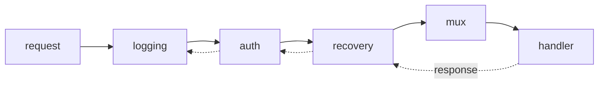

# HTTP server

Go is one of the few languages where the standard library is a complete answer
for HTTP services. `net/http` gives you a production server, a router with
method and path patterns (since Go 1.22), and a testing package that exercises
handlers without a network. Frameworks exist; most services do not need one.

The four exercises are the whole spine of a service: a handler, routing, JSON in
and out, and middleware.

## 1. Handlers

```go
type Handler interface {
    ServeHTTP(w http.ResponseWriter, r *http.Request)
}

func greetHandler(w http.ResponseWriter, r *http.Request) {
    name := r.URL.Query().Get("name")
    if name == "" {
        name = "world"
    }
    fmt.Fprintf(w, "Hello, %s!", name)
}
```

`httpsrv1`. One interface with one method — and `http.HandlerFunc` is a *named
func type* with a `ServeHTTP` method, so any function of that shape converts
into a `Handler`. That trick (a method on a func type, from the `methods`
chapter) is what lets you write plain functions everywhere.

The response writing rules, in order:

1. Set headers — `w.Header().Set(…)` — **before** anything else.
2. `w.WriteHeader(status)` once, if not 200.
3. Write the body.

Headers set after the first write are silently dropped, and a second
`WriteHeader` logs "superfluous response.WriteHeader call". `http.Error(w, msg,
code)` does steps 2 and 3 for an error in one call.

## 2. Routing with `ServeMux`

```go
mux := http.NewServeMux()
mux.HandleFunc("GET /users/{id}", userHandler)     // Go 1.22 patterns
mux.HandleFunc("POST /users", createHandler)

id := r.PathValue("id")
```

`httpsrv2`. Before 1.22, `ServeMux` matched prefixes only and every project
pulled in a router for `GET /users/{id}`. Now the pattern is
`[METHOD ]/path/{wildcard}`, `r.PathValue` reads the segment, and `{rest...}`
captures the remainder of a path.

Precedence is by **specificity**, not registration order: `/users/{id}` beats
`/users/`, and a pattern with a method beats one without. A trailing slash still
means "subtree", so `/static/` matches everything beneath it.

Use your own `*ServeMux`, not `http.DefaultServeMux` — the default is a package
global that any imported package can register on, which is exactly how
`net/http/pprof` exposes debug endpoints you did not intend to publish
(`pprof3`).

## 3. JSON in, JSON out

```go
func echoHandler(w http.ResponseWriter, r *http.Request) {
    var req echoReq
    if err := json.NewDecoder(r.Body).Decode(&req); err != nil {
        http.Error(w, "bad request", http.StatusBadRequest)
        return
    }

    w.Header().Set("Content-Type", "application/json")
    if err := json.NewEncoder(w).Encode(echoResp{Greeting: "Hello, " + req.Name + "!"}); err != nil {
        // the status is already sent; log it, do not re-write the response
        return
    }
}
```

`httpsrv3`. Decode from `r.Body` (a reader), encode to `w` (a writer) —
streaming both ways, no intermediate buffer. Set `Content-Type` **before**
encoding, because `Encode` writes immediately and headers are frozen after that.

Two hardening habits: cap the body with `http.MaxBytesReader(w, r.Body, 1<<20)`
so a client cannot exhaust memory, and use `dec.DisallowUnknownFields()` when a
typo in a field name should be an error rather than a silent zero.

## 4. Middleware

```go
func withHeader(value string) func(http.Handler) http.Handler {
    return func(next http.Handler) http.Handler {
        return http.HandlerFunc(func(w http.ResponseWriter, r *http.Request) {
            w.Header().Set("X-App", value)
            next.ServeHTTP(w, r)          // the chain continues here
        })
    }
}
```

`httpsrv4`. Middleware is `func(http.Handler) http.Handler` — a closure that
wraps a handler and returns a handler. Because the type is standard, middleware
from different sources composes:

```ascii
request ──► logging ──► auth ──► recovery ──► mux ──► handler
                                                       │
response ◄── logging ◄── auth ◄── recovery ◄───────────┘
```



Order matters and reads outside-in: `logging(auth(mux))` logs everything
including rejected requests. Forgetting `next.ServeHTTP` silently swallows the
request — the handler never runs and the client gets an empty 200.

To observe the status code (for logging or metrics), wrap the
`http.ResponseWriter` in a type that records what `WriteHeader` was called with;
that is what `logingest7` builds.

## 5. Running one for real

```go
srv := &http.Server{
    Addr:              ":8080",
    Handler:           mux,
    ReadHeaderTimeout: 5 * time.Second,     // never omit
    ReadTimeout:       15 * time.Second,
    WriteTimeout:      30 * time.Second,
    IdleTimeout:       60 * time.Second,
}
log.Fatal(srv.ListenAndServe())
```

`http.ListenAndServe(addr, mux)` is fine for an example and wrong for a service:
it has **no timeouts**, so a slow-loris client holds connections open
indefinitely. Graceful shutdown belongs here too — see the next chapter.

Every handler runs in **its own goroutine**, so anything they share needs the
`sync` chapter's discipline.

## Gotchas

- **Headers must be set before the first write**; afterwards they are ignored.
- **`WriteHeader` twice** logs a superfluous-call warning and keeps the first.
- **Always `return` after `http.Error`** — it does not stop the handler.
- **`http.DefaultServeMux` is global**; an import can register on it.
- **Middleware that forgets `next.ServeHTTP`** drops the request silently.
- **`ListenAndServe` has no timeouts.** Build an `http.Server`.
- **Handlers run concurrently** — shared state needs a lock.
- **`r.Body` is a stream, readable once**, and should be closed by the server
  (you do not need to close it in a handler).

## The exercises

- **httpsrv1** — write a handler reading a query parameter, tested with
  `httptest`.
- **httpsrv2** — route with `"GET /users/{id}"` and read the path value.
- **httpsrv3** — decode a JSON request and encode a JSON response.
- **httpsrv4** — write middleware that sets a header and calls the next handler.

## Source references

- [pkg.go.dev: net/http](https://pkg.go.dev/net/http) ·
  [ServeMux patterns](https://pkg.go.dev/net/http#ServeMux) ·
  [httptest](https://pkg.go.dev/net/http/httptest)
- [Go blog: Routing enhancements for Go 1.22](https://go.dev/blog/routing-enhancements)
- [Go blog: Writing Web Applications](https://go.dev/doc/articles/wiki/)
- [Cloudflare: The complete guide to Go net/http timeouts](https://blog.cloudflare.com/the-complete-guide-to-golang-net-http-timeouts/)

**Next: [http_server_advanced](../http_server_advanced/) →** — CSRF protection,
exact wildcard matching, and reverse proxying.
