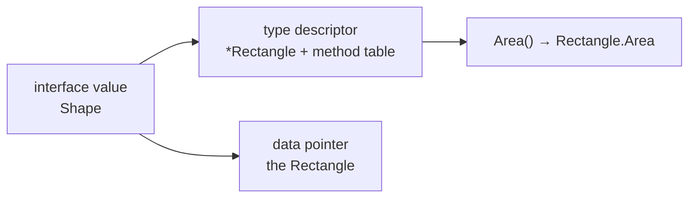

# Interfaces

An interface is a list of method signatures. Any type that has those methods
satisfies it — **implicitly**, with no `implements` keyword and no declared
relationship. That inversion is the defining feature of Go's type system: the
*consumer* declares what it needs, and types written before that interface
existed can satisfy it.

The four exercises walk the whole surface: satisfy an interface with two types,
implement the standard-library `Stringer`, recover the concrete type out of an
interface value, and compose interfaces by embedding.

## 1. Implicit satisfaction

```go
type Shape interface {
    Area() float64
}

type Rectangle struct{ W, H float64 }
func (r Rectangle) Area() float64 { return r.W * r.H }   // now a Shape

func totalArea(shapes []Shape) float64 { … }
```

`Rectangle` never mentions `Shape`. It has the method, so it satisfies it — and
so does any type in any package, including ones that predate your interface.

Two conventions follow from this and are worth adopting immediately:

- **Keep interfaces small.** One or two methods. `io.Reader` has one, and it is
  the most reused type in Go.
- **Define the interface where it is used, not where it is implemented.** The
  package that *consumes* a `Store` declares what a `Store` must do; the package
  that implements one just returns its concrete type. "Accept interfaces, return
  structs."

## 2. What an interface value is

An interface value is **two words**: a pointer to type information (which
includes the method table) and a pointer to the data.



```ascii
var s Shape = Rectangle{3, 4}

  s: [ type: Rectangle ][ data: ──► {W:3 H:4} ]
          |
          +-- method table: Area -> Rectangle.Area

  var s Shape          -> [ type: nil ][ data: nil ]   s == nil
  var p *Rectangle     -> [ type: *Rectangle ][ nil ]  s != nil  (!)
```

A call through the interface looks up `Area` in that table and calls it with the
data pointer — dynamic dispatch, one indirection.

That layout explains the single nastiest bug in Go:

```go
var p *Rectangle = nil
var s Shape = p
s == nil      // FALSE — the type word is set, only the data is nil
```

An interface is `nil` only when **both** words are nil. Returning a typed nil
pointer as an `error` produces `err != nil` with nothing inside — always return
a literal `nil`, never a nil concrete pointer stored in an interface variable.

## 3. Getting the concrete type back

```go
switch x := v.(type) {          // type switch
case int:
    return fmt.Sprintf("int: %d", x)
case string:
    return fmt.Sprintf("string: %s", x)
default:
    return "unknown"
}

n, ok := v.(int)   // comma-ok assertion: no panic on mismatch
n := v.(int)       // plain assertion: PANICS if v is not an int
```

`interfaces3` is the type switch. The assertion checks the type word at run
time; the comma-ok form reports the failure instead of panicking, and is what
you want everywhere except code that has just proved the type.

`any` is an alias for `interface{}` — the empty interface, satisfied by every
type, and the reason `fmt.Println` accepts anything. Reaching for `any` in your
own APIs usually means the type parameter you actually wanted is a generic
(`generics1`).

## 4. Standard interfaces, and embedding

Implementing an interface from the standard library gets you behaviour for free:

```go
func (p Point) String() string { return fmt.Sprintf("(%d, %d)", p.X, p.Y) }
```

That is `fmt.Stringer`, and every `%v`, `Print`, and log line now formats
`Point` your way (`interfaces2`). `error` is the same idea with `Error() string`.

Interfaces compose by embedding:

```go
type Reader interface{ Read() string }
type Writer interface{ Write(s string) }

type ReadWriter interface {   // interfaces4
    Reader
    Writer
}
```

A type satisfies `ReadWriter` by having both methods — exactly how `io.ReadWriter`,
`io.ReadCloser` and friends are built out of `io.Reader` and `io.Writer`.

Finally, the compile-time assertion worth knowing, which `interfaces2` uses:

```go
var _ fmt.Stringer = Point{}   // fails the build if Point stops satisfying it
```

It costs nothing at run time and turns a future refactor into a compile error
instead of a surprise.

## Gotchas

- **A nil pointer in an interface is not a nil interface.** The classic
  `err != nil` bug.
- **Pointer-receiver methods mean `*T` satisfies the interface, not `T`.** See
  the `methods` chapter's table.
- **A plain type assertion panics**; use comma-ok unless you have just checked.
- **Big interfaces are hard to satisfy and hard to fake.** Prefer several small
  ones.
- **Don't define an interface with only one implementation "for testing"** —
  define it in the consumer when a second implementation (a fake) actually
  appears.
- **Interface dispatch is not free**: an indirect call, and often a heap
  allocation to store the value. Irrelevant in normal code, measurable in a hot
  loop.

## The exercises

- **interfaces1** — give two structs an `Area` method and sum them through
  `[]Shape`.
- **interfaces2** — implement `fmt.Stringer`, with a compile-time satisfaction
  check.
- **interfaces3** — recover the concrete type with a type switch.
- **interfaces4** — satisfy an interface built by embedding two others.

## Source references

- [Go spec: Interface types](https://go.dev/ref/spec#Interface_types) ·
  [Type assertions](https://go.dev/ref/spec#Type_assertions) ·
  [Type switches](https://go.dev/ref/spec#Type_switches)
- [Go FAQ: Why is my nil error value not equal to nil?](https://go.dev/doc/faq#nil_error)
- [Effective Go: Interfaces and methods](https://go.dev/doc/effective_go#interfaces_and_types)
- [Go Code Review Comments: interfaces](https://go.dev/wiki/CodeReviewComments#interfaces)
- [pkg.go.dev: fmt.Stringer](https://pkg.go.dev/fmt#Stringer) ·
  [io.Reader](https://pkg.go.dev/io#Reader)

**Next: [enums](../enums/) →** — building a small closed set of named values out
of a defined type and `iota`.
