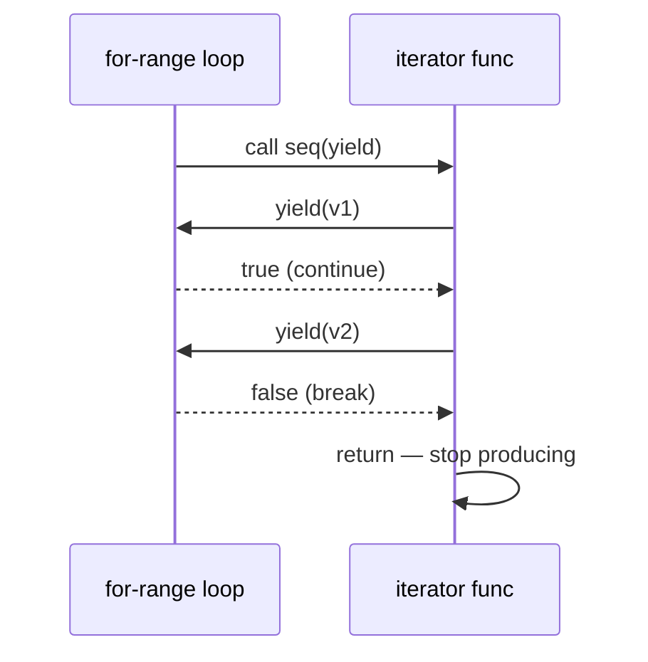

# Iterators (iter.Seq)

Before Go 1.23, producing a sequence lazily meant one of three unsatisfying
options: build the whole slice up front, hand out a channel (a goroutine, a
close, and a leak if the consumer left early), or invent a `Next()`/`Err()`
interface per package.

Range-over-function replaces all of it. An iterator is just a **function of a
particular shape**, and `for range` knows how to drive it:

```go
type Seq[V any]     func(yield func(V) bool)
type Seq2[K, V any] func(yield func(K, V) bool)
```

No goroutine, no channel, no allocation per element, and `break` works.

## 1. The protocol

```go
func countUp(n int) iter.Seq[int] {
    return func(yield func(int) bool) {
        for i := 1; i <= n; i++ {
            if !yield(i) {
                return          // consumer stopped — stop producing
            }
        }
    }
}

for v := range countUp(3) { … }   // 1, 2, 3
```

The compiler rewrites the `range` into a call: your loop body **becomes** the
`yield` function. So control bounces between the two:

```ascii
for v := range seq { body }

  seq(yield)                 yield = the loop body
    │
    ├─ yield(1) ──► body ──► true    (keep going)
    ├─ yield(2) ──► body ──► true
    └─ yield(3) ──► body ──► false   (break/return in the body)
                                └──► iterator must return NOW
```



**`yield`'s return value is the contract.** `false` means the consumer is gone;
an iterator that ignores it and keeps yielding will panic
(`runtime error: range function continued iteration after loop body exit`) —
or, worse, keep doing work nobody wants. Every `yield` call gets an
`if !yield(v) { return }`.

## 2. `Seq2`, and getting the pair order right

`iter.Seq2[K, V]` yields two values — key/value from a map, index/element from a
slice, value/error from a scanner:

```go
func Enumerate(s []int) iter.Seq2[int, int] {
    return func(yield func(int, int) bool) {
        for i, v := range s {
            if !yield(i, v) {   // index FIRST, value second
                return
            }
        }
    }
}
```

`iter2` swaps them, which compiles perfectly — `Seq2[int, int]` cannot tell an
index from a value — and produces nonsense at the call site. When both halves
have the same type, the test is the only thing standing between you and a silent
bug.

## 3. Composing: filters, adapters, and `slices`

An iterator that *takes* an iterator is where this starts paying:

```go
func Filter[V any](seq iter.Seq[V], keep func(V) bool) iter.Seq[V] {
    return func(yield func(V) bool) {
        for v := range seq {
            if keep(v) && !yield(v) {
                return
            }
        }
    }
}
```

`iter1`. Nothing is materialised — `Filter` is lazy, and only the values the
consumer actually asks for are computed.

The standard library supplies both ends of the pipeline:

| Call | Direction |
|---|---|
| `slices.Values(s)`, `slices.All(s)` | slice → `Seq` / `Seq2` |
| `maps.Keys(m)`, `maps.Values(m)`, `maps.All(m)` | map → `Seq` / `Seq2` |
| `slices.Collect(seq)`, `slices.Sorted(seq)` | `Seq` → slice |
| `maps.Collect(seq2)` | `Seq2` → map |

Note the asymmetry `iter3` is built on: `slices.Collect` takes a `Seq`, not a
`Seq2`. To collect a pair-iterator's values you first **project** it down —
range the pairs, yield only the half you want. That adapter is three lines and
comes up constantly.

## 4. `iter.Pull`: when `range` is the wrong shape

A `range` loop drives an iterator from start to finish. You cannot pause one,
advance another, and resume — which is exactly what zipping, merging, or
lookahead need. `iter.Pull` inverts the iterator into a pair of functions you
call yourself:

```go
next, stop := iter.Pull(b)
defer stop()                    // always — it releases the pull machinery

for x := range a {
    y, ok := next()             // one value from b, on demand
    if !ok {
        break                   // b is exhausted
    }
    out = append(out, x+y)
}
```

That is `iter4`. The broken version ranges `b` inside the loop over `a`, which
restarts `b` from the beginning every pass — so every pair uses `b`'s first
element and nothing ever notices that `b` ran out.

`iter.Pull2` does the same for `Seq2`. Both are implemented with a coroutine
under the hood, so `stop()` is not optional: skipping it leaks the paused
producer until GC. `next` returns `(V, bool)` where `false` means the sequence
ended, and calling `next` after `stop` returns `false` forever.

## Gotchas

- **Ignoring `yield`'s `false` return** panics with "range function continued
  iteration after loop body exit".
- **`Seq2` pair order is not checked** when both types match. Test it.
- **`slices.Collect` takes a `Seq`, not a `Seq2`** — project first.
- **Iterators are lazy and usually re-runnable**; `slices.Values(s)` can be
  ranged twice, but an iterator over a network stream generally cannot. Say
  which yours is.
- **`defer stop()` after every `iter.Pull`.**
- **A `Seq` is not a snapshot.** Mutating the underlying collection during
  iteration has the same hazards as mutating it during a plain `range`.
- **Errors need a `Seq2[V, error]`** or a separate `Err()` — the protocol has
  no error channel of its own.

## The exercises

- **iter1** — build a lazy `Filter` over an `iter.Seq[V]`.
- **iter2** — yield `(index, value)` in the right order from an `iter.Seq2`.
- **iter3** — project a `Seq2` down to a `Seq` so `slices.Collect` accepts it.
- **iter4** — drive a second sequence with `iter.Pull` to zip two iterators in
  lockstep.

## Source references

- [Go blog: Range Over Function Types](https://go.dev/blog/range-functions) — the
  design, including why `yield` returns a bool
- [pkg.go.dev: iter](https://pkg.go.dev/iter) — `Seq`, `Seq2`, `Pull`, `Pull2`
- [Go spec: For statements with range clause](https://go.dev/ref/spec#For_range)
  — the rewrite rules
- [pkg.go.dev: slices.Collect](https://pkg.go.dev/slices#Collect) ·
  [maps.All](https://pkg.go.dev/maps#All)

**Next: [dependency_injection](../dependency_injection/) →** — the other side of
composability: passing behaviour in rather than reaching for it.
