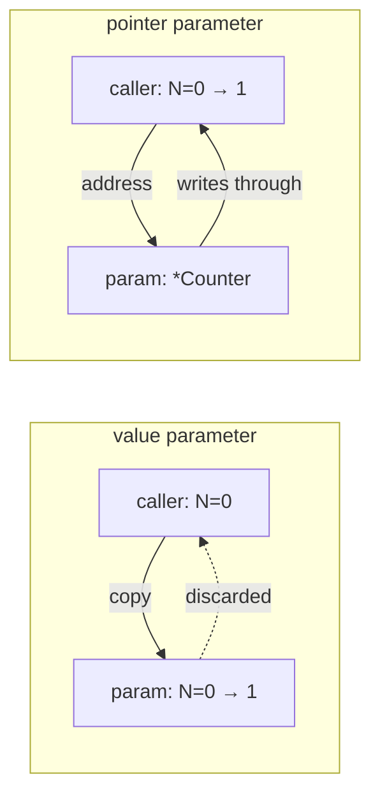

# Pointers

Go passes **everything** by value. A function receives a copy of each argument,
so writing to a parameter changes nothing the caller can see. A pointer is how
you opt out: instead of the value, you pass its address, and the function writes
through that address to the caller's own memory.

That is the entire purpose, and these three exercises are the entire story —
write through a `*int`, mutate a struct through a `*Account`, and see side by
side that a value parameter cannot do what a pointer parameter can.

## 1. `&` and `*`

```go
n := 21
p := &n        // p is a *int holding n's address
*p = *p * 2    // write through the pointer
fmt.Println(n) // 42 — the caller's variable changed
```

- `&x` takes the address of `x`, producing a `*T`.
- `*p` **dereferences**: as a value it reads what `p` points at, and on the left
  of `=` it writes there.
- `*T` in a type position means "pointer to T"; the same symbol, two jobs.

The zero value of a pointer is `nil`, and dereferencing `nil` panics with
`invalid memory address or nil pointer dereference`. There is no pointer
arithmetic in Go: you cannot do `p + 1`, which removes an entire category of
memory bugs (and is exactly what `unsafe.Pointer` exists to allow, deliberately
and visibly).

## 2. Why a value parameter cannot mutate

```go
func incValue(c Counter)  { c.N++ }   // increments the copy
func incPointer(c *Counter) { c.N++ } // increments the caller's Counter
```

```ascii
incValue(c)                      incPointer(&c)

  caller   c: [ N=0 ]              caller   c: [ N=0 ] ◄──┐
                │ copy                                    │ writes here
  callee   c: [ N=0 ] -> N=1       callee   c: ptr ───────┘
           (discarded on return)
```



`pointers3` runs both and asserts both outcomes: the value version *must not*
change the caller, the pointer version *must*.

Slices, maps, and channels look like exceptions — a function can modify their
contents without a pointer — but they are not. What gets copied is a small
header that points at shared data, so the header is a copy and the data is
shared. That is why `append` inside a function does not extend the caller's
slice: it changes the copy's length.

## 3. Structs and automatic dereferencing

```go
func deposit(a *Account, amount int) {
    a.Balance += amount    // no (*a).Balance needed
}
```

Go dereferences automatically for field access and method calls through a
pointer, so `a.Balance` works whether `a` is an `Account` or an `*Account`. The
explicit `(*a).Balance` is legal and never written.

The reverse also happens: calling a pointer-receiver method on an addressable
value takes the address for you (`r.Scale(2)` becomes `(&r).Scale(2)`). That is
the `methods` chapter's subject, and the reason receiver choice matters more
than it first appears.

## 4. Where the value actually lives

```go
func newCounter() *Counter {
    c := Counter{}   // looks like a local
    return &c        // ...and yet returning its address is safe
}
```

In C this is a dangling pointer. In Go it is routine: the compiler performs
**escape analysis**, and any value whose address outlives the function is
allocated on the heap instead of the stack, with the garbage collector keeping
it alive as long as something references it.

So "stack or heap" is not something you declare — it is inferred. You can see
the decision:

```sh
go build -gcflags='-m' ./...    # "moved to heap: c", "does not escape"
```

Values that do not escape stay on the stack and cost nothing to reclaim. This is
why taking a pointer is not automatically an optimisation: it can push a value
to the heap that would otherwise have been free.

## Gotchas

- **`nil` dereference panics.** Check pointers that can legitimately be absent.
- **A pointer receiver on a `nil` receiver is fine** *until* it touches a field —
  methods can be called on `nil` pointers.
- **Pointers to loop variables were a trap before Go 1.22**, when every
  iteration shared one variable. Since 1.22 each iteration has its own.
- **`*p` on the left writes; `*p` on the right reads.** Same syntax, and the
  most common source of confusion when learning.
- **Do not take a pointer just to "avoid a copy"** — for small structs the copy
  is cheaper than the heap allocation and the indirection.
- **`&m[k]` is not allowed for maps** (entries move); `&s[i]` for slices is,
  until an `append` reallocates.

## The exercises

- **pointers1** — double the caller's `int` by writing through a `*int`.
- **pointers2** — add to an `Account`'s balance through an `*Account`.
- **pointers3** — prove the difference: the value parameter must not change the
  caller, the pointer parameter must.

## Source references

- [Go spec: Pointer types](https://go.dev/ref/spec#Pointer_types) ·
  [Address operators](https://go.dev/ref/spec#Address_operators)
- [Go FAQ: When are function parameters passed by value?](https://go.dev/doc/faq#pass_by_value)
- [Go FAQ: stack or heap?](https://go.dev/doc/faq#stack_or_heap) — escape
  analysis in the language authors' words
- [Effective Go: Pointers vs. Values](https://go.dev/doc/effective_go#pointers_vs_values)
- [A Tour of Go: Pointers](https://go.dev/tour/moretypes/1)

**Next: [methods](../methods/) →** — the same value/pointer choice, made once in
a receiver and enforced everywhere the type is used.
