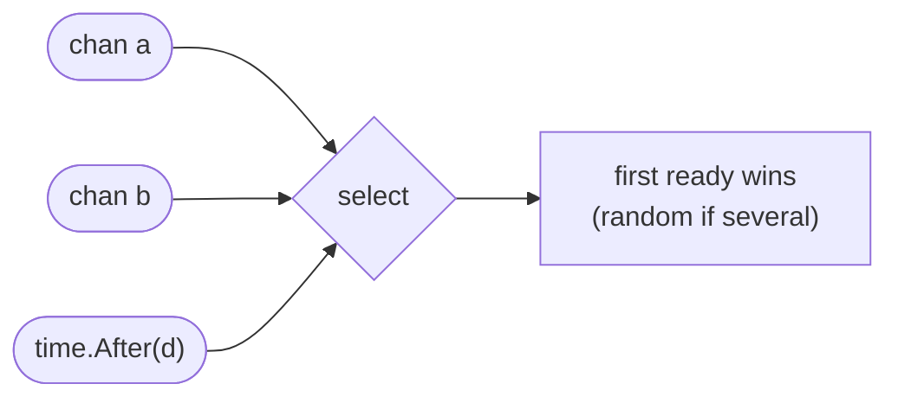

# Select

A channel operation on its own commits you to one channel: `<-ch` waits for
`ch` and nothing else. `select` removes that commitment. It lists several channel
operations, blocks until **one** of them can proceed, runs that case, and
abandons the rest.

That one primitive covers most of what real concurrent code needs: take whichever
answer arrives first, give up after a deadline, poll without blocking, and stop
when someone cancels. The three exercises here are those shapes; `context` and
`concurrency_patterns` are them combined.

## 1. How `select` chooses

The compiler turns a `select` into a call to `runtime.selectgo`, which does two
passes:

1. **Poll.** It walks the cases in a *randomly permuted* order and takes the
   first one that can proceed right now.
2. **Park.** If none can, it enqueues the goroutine on every channel's wait
   queue at once and parks. The first channel to become ready wakes it, and the
   runtime dequeues it from all the others.

Two consequences worth keeping:

- **Ready cases are chosen uniformly at random, never top to bottom.** Case
  order carries no priority. If you need priority, nest: try the urgent channel
  in a `select` with `default`, then fall back to the full `select`.
- **A parked `select` costs nothing while it waits.** It is not a poll loop;
  the goroutine is off the run queue until a sender or the timer wakes it.



```ascii
chan a         -+
chan b         -+-> select -> first ready wins
time.After(d)  -+             (random if several)
```

## 2. Timeouts: race the work against a clock

```go
select {
case v := <-ch:
    return v, true
case <-time.After(d):
    return 0, false
}
```

`time.After(d)` returns a channel that receives one value after `d`. Putting it
in a `select` next to the real work means: whichever happens first wins, and the
loser is simply never selected.

An old caveat has expired. Before Go 1.23 the timer created by `time.After` was
retained until it fired, so a timeout inside a hot loop piled up timers — the
reason style guides said to use `time.NewTimer` and `Stop` it. Since Go 1.23
timers are collectable as soon as they become unreachable, so `time.After` in a
loop no longer leaks. A reusable `time.NewTimer` is still cheaper in a very hot
loop, but it is now an optimisation, not a correctness fix.

The real limitation of `time.After` is scope: it times out *this one wait*. It
cannot tell the code on the other side of the channel to stop working, and it
does not propagate across function or process boundaries. That is what `context`
is for — and `ctx.Done()` is just another channel you put in the same `select`.

## 3. `default`: refusing to wait

Adding `default` makes a `select` non-blocking. It runs pass 1 only: if no case
is ready, `default` executes immediately.

```go
select {
case v := <-ch:
    return v, true
default:
    return 0, false   // nothing ready — don't block
}
```

This is the *try* form — a single attempt, `TryLock` for channels. Two shapes
use it well: draining a channel opportunistically, and a send that must not
block on a full buffer (dropping metrics rather than stalling the request path).

One shape uses it badly: `for { select { …; default: } }` with nothing in the
default branch. That is a spin loop burning a core to ask "anything yet?"
thousands of times a millisecond. If you want to wait, drop the `default` and
let the runtime park the goroutine — that is the whole point of `select`.

## 4. `nil` channels turn cases off

A `nil` channel blocks forever, so a `select` case reading from one can never be
chosen. Assigning `nil` to a channel variable is therefore how you *disable* a
case, and it is the idiomatic way to drain two streams that end at different
times:

```go
for a != nil || b != nil {
    select {
    case v, ok := <-a:
        if !ok { a = nil; continue }   // a is done; stop selecting on it
        use(v)
    case v, ok := <-b:
        if !ok { b = nil; continue }
        use(v)
    }
}
```

Without the `a = nil`, a closed channel is *always* ready and returns zero values
as fast as the loop can spin — a busy loop that looks like a working program.

## Gotchas

- **`select {}` with no cases blocks forever.** Occasionally deliberate in a
  server's `main`; usually a mistake.
- **A closed channel is always ready.** In a loop, a case on a closed channel
  starves the others and spins. Detect the close with comma-ok and `nil` the
  channel out.
- **Only the chosen case's expression takes effect**, but *every* case's channel
  expression is evaluated once, before the wait — including `time.After(d)`, so
  the timer starts when the `select` is reached, not when the case is taken.
- **`select` with `default` does not "check" the channel** so much as sample it;
  the answer is stale immediately. Never build logic on repeated sampling.
- **A `break` inside a case breaks the `select`, not the enclosing `for`.** Use
  a labelled break or a `return`.

## The exercises

- **select1** — return whichever of two channels has a value first, and see the
  random choice when both are ready.
- **select2** — add a deadline by racing the receive against `time.After`.
- **select3** — add `default` for a non-blocking try, and reason about when
  polling is legitimate.

## Source references

- [Go spec: Select statements](https://go.dev/ref/spec#Select_statements) — the
  uniform-random choice is specified, not an implementation accident
- [`src/runtime/select.go`](https://github.com/golang/go/blob/master/src/runtime/select.go)
  — `selectgo`, the permuted poll order and the lock-ordering that prevents
  deadlock while enqueuing on every channel
- [Go 1.23 release notes: timers](https://go.dev/doc/go1.23#timer-changes) — why
  the `time.After` leak advice is obsolete
- [Go by Example: Select](https://gobyexample.com/select) ·
  [Timeouts](https://gobyexample.com/timeouts) ·
  [Non-Blocking Channel Operations](https://gobyexample.com/non-blocking-channel-operations)

**Next: [sync](../sync/) →** — when the state really is shared and a channel is
the wrong tool.
