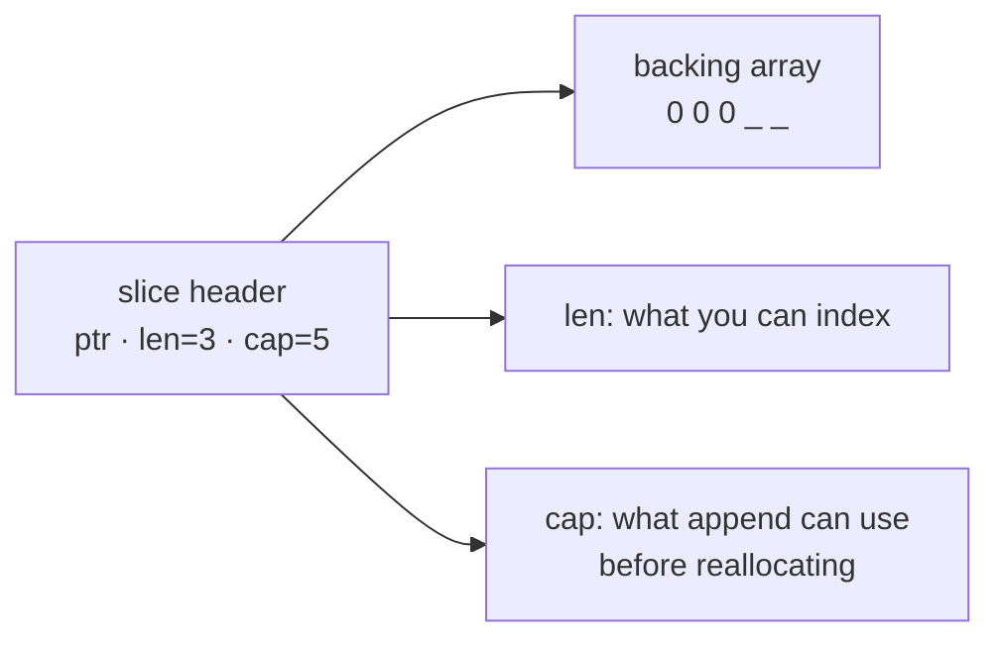

# Slices

A slice is the workhorse collection in Go, and it is three words of data: a
**pointer** to an array, a **length**, and a **capacity**. That is the whole
type. Everything surprising about slices — why `append` sometimes affects a
second slice and sometimes does not, why passing one to a function lets it
mutate your data but not extend it — falls straight out of those three fields.

The four exercises here build the picture from the bottom: create one, take a
sub-slice, append to it, and index it out of bounds.

## 1. The slice header

```go
s := make([]int, 3, 5)   // len 3, cap 5
```

```ascii
s -> ptr ──► [ 0 ][ 0 ][ 0 ][ _ ][ _ ]   backing array, 5 long
     len = 3   \______ visible ______/
     cap = 5   \___________ reachable by re-slicing ___________/
```



- **`len(s)`** — how many elements you may index right now. `s[3]` panics.
- **`cap(s)`** — how many the backing array holds from `s`'s start. `append`
  can use the spare room without allocating.

`make([]T, len, cap)` needs the element type; `slices1` leaves it out. A literal
(`[]int{1,2,3}`) allocates the array and sets `len == cap`. The zero value of a
slice is `nil`: `len` 0, `cap` 0, no array — and perfectly usable, since
`append` and `range` both handle it.

## 2. Sub-slicing: `s[low:high]`

```go
names := [4]string{"John", "Maria", "Carl", "Peter"}
last := names[2:4]   // ["Carl" "Peter"] — 2 included, 4 excluded
all  := names[:]     // the whole thing, as a slice
```

`low` is inclusive, `high` is exclusive, so the length is `high-low` — that is
`slices2`. The bound may go up to `cap`, not just `len`, which is why
`s[2:4]` can be legal on a slice whose length is 3.

The result **shares the same backing array**. Writing `last[0] = "X"` changes
`names[2]`. Nothing is copied, which is what makes sub-slicing free — and what
makes it a source of surprise. `slices.Clone(s)` when the sub-slice must be
independent.

That sharing has a memory consequence too: a 10-element sub-slice of a
million-element array keeps the whole array alive, because the pointer still
points into it.

## 3. `append`, and the reallocation step

```go
s = append(s, "Peter")        // ALWAYS assign the result
```

`append` writes into the spare capacity if there is any. If there is not, it
**allocates a bigger array, copies everything over, and returns a header
pointing at the new one** — which is why the return value is not optional.
`slices3` is that one line.

```ascii
cap left over:                 no cap left:
  before  [a][b][ _ ]            before  [a][b][c]      <- len == cap
  append  [a][b][c]              append  allocate [a][b][c][d][_][_][_][_]
  same backing array                     copy, then write; NEW array
```

Two things follow:

- **The aliasing is conditional.** Before growth, a slice sharing the array sees
  your appends; after growth it does not, because you moved. Code that relies on
  either behaviour is fragile — copy explicitly when you mean to share or not.
- **Growth is amortised, not free.** The runtime roughly doubles small slices
  and grows large ones by a smaller factor, so n appends cost O(n) overall. When
  you know the size, say so: `make([]T, 0, n)` avoids every intermediate copy.

## 4. Bounds, and the panics

```go
names := []string{"John", "Maria", "Carl", "Peter"}
names[3]      // "Peter" — valid
names[4]      // panic: index out of range [4] with length 4
names[5:10]   // panic: slice bounds out of range [:10] with capacity 4
```

`slices4` has both mistakes. Indexing is checked against `len`; slicing is
checked against `cap`. A constant index the compiler can prove is bad fails the
build; anything computed panics at run time. There is no silent out-of-bounds
read in Go.

## Gotchas

- **Always use `append`'s return value.** `append(s, x)` on its own is a
  discarded result, and `go vet` says so.
- **`s = append(s, x)` inside a function does not extend the caller's slice.**
  The header is a copy; the caller still sees the old length. Return the slice
  instead.
- **Sub-slices share storage** until an `append` forces a reallocation.
- **`s[i:j]` keeps the whole backing array alive** — clone if you keep a small
  window of a big buffer.
- **Slices are not comparable.** `s1 == s2` does not compile (only `s == nil`
  does); use `slices.Equal`.
- **A `nil` slice is usable**: `len`, `range`, and `append` all work. Prefer it
  to `[]T{}` as the empty value.

## The exercises

- **slices1** — `make` needs the element type: `make([]int, 3, 10)`, then read
  `len` and `cap`.
- **slices2** — take the last two elements with `[low:high]` bounds.
- **slices3** — `append` an element and return the new slice.
- **slices4** — fix an out-of-range index and an out-of-range sub-slice.

## Source references

- [Go blog: Go Slices — usage and internals](https://go.dev/blog/slices-intro) —
  the header diagram this chapter is built on
- [Go blog: Arrays, slices (and strings): the mechanics of 'append'](https://go.dev/blog/slices)
- [Go spec: Slice types](https://go.dev/ref/spec#Slice_types) ·
  [Appending and copying](https://go.dev/ref/spec#Appending_and_copying_slices)
- [`src/runtime/slice.go`](https://github.com/golang/go/blob/master/src/runtime/slice.go)
  — `growslice`, the actual growth policy
- [pkg.go.dev: slices](https://pkg.go.dev/slices) — `Clone`, `Equal`, `Sort`,
  `Contains` and friends

**Next: [maps](../maps/) →** — the other built-in collection, and the comma-ok
form that tells "absent" from "zero".
