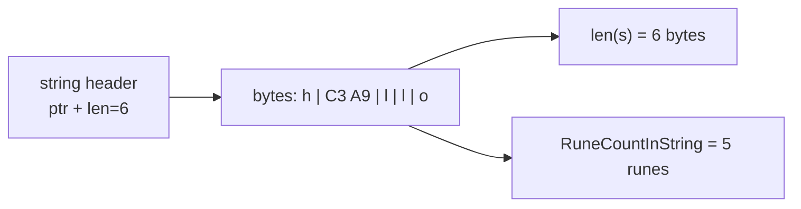

# Strings

A Go string is an **immutable sequence of bytes**. Not characters — bytes. It is
conventionally UTF-8 encoded, and everything confusing about strings in Go
follows from those two facts: `len("héllo")` is 6, `s[0]` gives you a number,
and you cannot assign to `s[0]` at all.

Once the byte/character distinction is clear, the rest is a small standard
library: `strings` for whole-string operations, `unicode/utf8` for counting and
decoding, `[]rune` when you truly need per-character indexing, and
`strings.Builder` when you are assembling one in a loop.

## 1. What a string value actually is

A string header is two words: a pointer to bytes, and a length. No capacity, no
terminator.

```ascii
s := "héllo"

header:   ptr ──► [ 'h' ][ 0xC3 ][ 0xA9 ][ 'l' ][ 'l' ][ 'o' ]
          len = 6          \_____ é _____/

len(s)                       -> 6   bytes
utf8.RuneCountInString(s)    -> 5   characters
s[1]                         -> 195 one byte of é, not "é"
```



Because the header carries a length, a substring is cheap: `s[1:3]` allocates
nothing, it makes a new header pointing into the same bytes. And because strings
are immutable, sharing those bytes is always safe — which is exactly why they
are immutable.

Immutability also means `s[0] = 'H'` does not compile. Build a new string
instead, or work on a `[]byte` and convert.

## 2. Bytes, runes, and the three indexing forms

A **rune** is a Unicode code point (`int32`). UTF-8 stores one in 1–4 bytes:
ASCII in 1, most European accents in 2, CJK in 3, emoji in 4.

```go
s := "héllo"

s[1]                          // byte 195 — half of é
for i, r := range s { … }     // r is a rune; i is its BYTE offset
[]rune(s)[1]                  // 'é' — but this allocates a new []rune
utf8.RuneCountInString(s)     // 5, without allocating
```

`for … range` over a string decodes UTF-8 as it goes: the index jumps 0, 1, 3,
4, 5 for `"héllo"` because `é` occupies two bytes. Indexing with `s[i]` does
not decode anything — it hands back one byte.

Convert to `[]rune` only when you need random access by character (reversing,
taking "the third character"). It copies the whole string, so it is O(n) in time
and memory — the reason `RuneCountInString` exists as a separate function.

`strings2` is exactly this: `len(s)` passes for `"hello"` and fails for
`"héllo"` and `"世界"`.

## 3. The `strings` package

The everyday operations, all returning **new** strings:

| Need | Call |
|---|---|
| case | `ToLower`, `ToUpper`, `EqualFold` (case-insensitive compare) |
| search | `Contains`, `HasPrefix`, `HasSuffix`, `Index` |
| edit | `ReplaceAll`, `Trim`, `TrimSpace`, `TrimPrefix` |
| split/join | `Split`, `SplitN`, `Fields`, `Join` |
| build | `Repeat`, `strings.Builder` |

`strings1` composes two of them — `ToLower` then `ReplaceAll` — into a slug.

Two habits worth forming early:

- **`EqualFold` for case-insensitive comparison**, not `ToLower(a) == ToLower(b)`
  — it avoids two allocations and handles Unicode folding properly.
- **`strings.Builder` for concatenation in a loop.** `s += x` allocates a new
  string every iteration, so a loop over n items copies O(n²) bytes; `Builder`
  grows one buffer:

```go
var b strings.Builder
for _, w := range words {
    b.WriteString(w)
}
return b.String()
```

## 4. Conversions and their cost

```go
b := []byte(s)     // copies
s2 := string(b)    // copies back
r := []rune(s)     // decodes and copies
```

Each conversion allocates, because a string may not share mutable memory with a
slice. The compiler optimises a few common cases (`for i, c := range []byte(s)`,
map lookups with `string(b)` keys), but assume a copy otherwise.

`string(65)` is a trap the compiler now rejects with a vet error: it produces
`"A"` (the rune with that value), not `"65"`. `strconv.Itoa(65)` is the
conversion you meant.

## Gotchas

- **`len(s)` is bytes.** The only correct answer to "how long is this text?"
  depends on whether you mean bytes, runes, or user-visible glyphs — and emoji
  with modifiers are several runes each.
- **Strings are immutable**: no `s[0] = 'H'`, ever.
- **`s[i]` is a `byte`**, and slicing at a bad offset (`s[0:2]` on `"世界"`)
  yields invalid UTF-8, printed as `�`.
- **Substrings share memory.** Holding a 10-byte substring of a 10 MB string
  keeps all 10 MB alive; copy it (`strings.Clone`) if it outlives the original.
- **`+=` in a loop is quadratic.** Use `strings.Builder`.
- **`strings.Split(s, "")` splits into UTF-8 sequences**, not bytes — one of the
  few places the package is rune-aware.

## The exercises

- **strings1** — lowercase and replace with the `strings` package to build a
  slug.
- **strings2** — count characters instead of bytes, with `unicode/utf8`.

## Source references

- [Go blog: Strings, bytes, runes and characters](https://go.dev/blog/strings) —
  the definitive explanation, worth reading in full
- [Go spec: String types](https://go.dev/ref/spec#String_types) ·
  [For statements with range clause](https://go.dev/ref/spec#For_range)
- [pkg.go.dev: strings](https://pkg.go.dev/strings) ·
  [strings.Builder](https://pkg.go.dev/strings#Builder) ·
  [unicode/utf8](https://pkg.go.dev/unicode/utf8)
- [Go blog: Text normalization](https://go.dev/blog/normalization) — when "same
  text" is not the same bytes

**End of the Fundamentals tier.** Next:
[arrays](../arrays/) and [slices](../slices/) — the same
pointer-plus-length idea, made mutable and growable.
