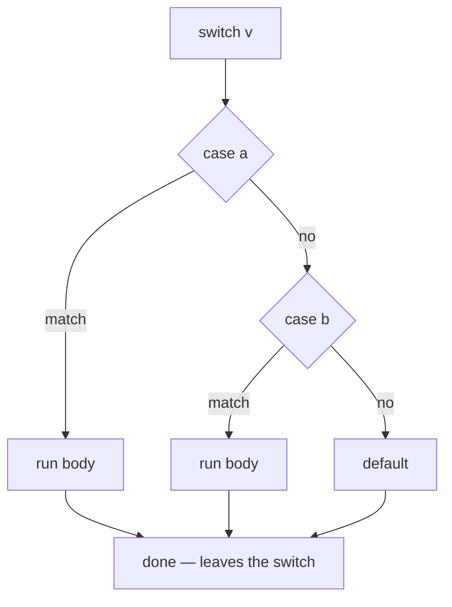

# Switch

`switch` is the multi-branch conditional, and Go's version is more useful than
the C one it looks like. It switches on any comparable value, not just integers;
it can drop the value entirely and switch on conditions; each case can list
several values; and — the big one — **cases do not fall through**, so the
forgotten `break` that has bitten every C programmer is not a bug you can write
here.

The three exercises cover the two forms. `switch1` switches on a variable,
`switch2` uses the conditionless form, and `switch3` maps seven integers to
seven strings — the shape where `switch` clearly beats an `if/else` ladder.

## 1. Expression switch: compare against a value

```go
switch status {
case "open":
    fmt.Println("status is open")
case "closed", "archived":     // several values in one case
    fmt.Println("not accepting writes")
default:
    fmt.Println("unknown status")
}
```

The value after `switch` is compared with `==` against each case in order, top
to bottom, and the first match runs. Any comparable type works: strings, numbers,
booleans, and even structs and arrays of comparable fields.

`switch1` leaves the value out but keeps value cases — `switch { case "open": }`
— which cannot compile: with no expression, Go switches on `true`, and `"open"`
is not a boolean.

## 2. Conditionless switch: an if/else ladder that reads well

Drop the expression and every case is a boolean condition:

```go
switch {
case n < 0:
    return "negative"
case n == 0:
    return "zero"
case n < 10:
    return "small"
default:
    return "large"
}
```

This is `switch true`, and it is the idiomatic replacement for a long
`if/else if` chain — the conditions line up in a column instead of drifting
right. `switch2`'s `case:` with nothing after it is the error worth meeting
once: every case needs something to evaluate, and the catch-all is spelled
`default`, not an empty case.

`default` may appear anywhere in the list, but conventionally goes last. Without
it, a switch that matches nothing simply does nothing.

## 3. No fallthrough — and the escape hatch



```ascii
switch v
  case a:  match -> run body -> done
  case b:  match -> run body -> done
  default:          run body -> done

no implicit fall-through; each body exits the switch
```

Each case body ends the switch on its own. `break` inside a case is therefore
redundant (it is only needed to break out of a `switch` nested in a `for` — and
then you want a labelled break, because a bare `break` leaves the *switch*, not
the loop).

When you genuinely want the next case's body too, ask for it:

```go
switch n {
case 1:
    fmt.Println("one")
    fallthrough      // runs case 2's body as well
case 2:
    fmt.Println("two")
}
```

`fallthrough` must be the last statement in the case, and it jumps
unconditionally — the next case's condition is *not* evaluated. It is rare in
real code; seeing it should make you look twice.

## 4. The initialiser, and the two other switches

Like `if`, a switch can run a short statement first, scoping its variables to
the switch:

```go
switch v := compute(); {      // conditionless, but v is in scope
case v > 100:
    …
}
```

Two related forms appear later in the curriculum:

- **Type switch** — `switch x := v.(type)` picks a branch by the dynamic type
  inside an interface value (`interfaces3`).
- **`select`** — looks like a switch over channel operations, but chooses among
  *ready* cases at random rather than in order (`select1`).

## Gotchas

- **A conditionless switch compares against `true`**, so its cases must be
  boolean expressions. Mixing the two forms is `switch1`'s error.
- **Cases are evaluated in order** and stop at the first match, so put the
  narrow conditions before the broad ones.
- **`break` inside a case does nothing useful**; to leave an enclosing loop use
  a label.
- **`fallthrough` skips the next case's condition** entirely.
- **Duplicate constant cases are a compile error** (`case 1: … case 1:`), but
  duplicate *expressions* in a conditionless switch are not — the second one is
  simply unreachable.
- **An empty case body is legal** and means "match this, do nothing" — sometimes
  deliberate, often a missing line.

## The exercises

- **switch1** — switch on the variable instead of leaving the expression out.
- **switch2** — replace the empty `case:` with `default`.
- **switch3** — map 0–6 to weekday names; the shape `switch` exists for.

## Source references

- [Go spec: Switch statements](https://go.dev/ref/spec#Switch_statements) ·
  [Fallthrough](https://go.dev/ref/spec#Fallthrough_statements)
- [Effective Go: Switch](https://go.dev/doc/effective_go#switch)
- [A Tour of Go: Switch](https://go.dev/tour/flowcontrol/9) ·
  [Switch with no condition](https://go.dev/tour/flowcontrol/11)
- [Go by Example: Switch](https://gobyexample.com/switch)

**Next: [functions](../functions/) →** — packaging those branches into something
with a name, parameters, and more than one return value.
