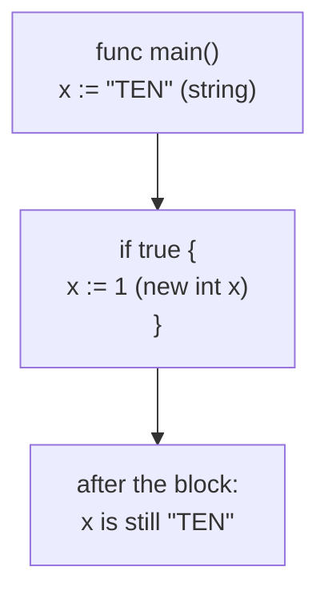

# Variables

A variable binds a name to a piece of memory of a fixed type. In Go both halves
of that sentence are enforced at compile time: the name must exist before you
assign to it, and the type is fixed the moment the variable is declared and can
never change afterwards. A lot of Go's beginner errors are the compiler holding
you to those two rules.

The syntax is small — `var` with a type, `var` with a value, `:=` inside a
function, `const` for compile-time values — and these six exercises walk through
each form by breaking it. Every failure here is a *compile* error, which is the
point: the whole class of "variable does not exist yet" and "wrong type" bugs
never reaches a running program.

## 1. Four ways to declare, one to pick

```go
var x int        // declared, zero value 0
var x int = 5    // type and value — the redundant form
var x = 5        // type inferred from the value: int
x := 5           // short form; only inside a function
```

They produce the same variable. The idiom is: `:=` inside functions, `var x = v`
when you want the declaration to stand out, `var x T` when you want the zero
value, and the fully explicit form only when inference would pick the wrong type
(`var ratio float64 = 3` rather than the `int` inference would give).

`:=` is not available at package level — a file's top level accepts only
declarations, so package variables always use `var`.

## 2. Zero values: there is no uninitialised memory

A declared-but-unassigned variable is not garbage and not "undefined". Go gives
it the zero value of its type:

| Type | Zero value |
|---|---|
| numeric (`int`, `float64`, …) | `0` |
| `bool` | `false` |
| `string` | `""` (empty, not nil) |
| pointer, slice, map, channel, func, interface | `nil` |

That guarantee is why `var buf bytes.Buffer` is immediately usable, and why a
struct with no constructor still has meaningful fields. It also means "was this
set?" is not answerable from the value alone — the reason the comma-ok forms
(`v, ok := m[k]`) exist.

`var x` on its own (variables3) does not compile: with neither a type nor a
value, the compiler has no zero value to give.

## 3. Declaration is not assignment

`x = 5` assigns; `var x = 5` declares *and* assigns. Assigning to a name that
was never declared is a compile error (variables2), and so is declaring a name
you never use — Go treats an unused local variable as a mistake worth stopping
for, not a warning to scroll past.

The rule has one deliberate escape hatch, the blank identifier:

```go
_, err := doSomething()   // the first result is deliberately discarded
```

## 4. Blocks, shadowing, and the trap in variables4

Every `{ … }` opens a new scope. A `:=` inside a block creates a **new**
variable, even if the outer scope already has that name — the inner one
*shadows* it, and the outer value is untouched when the block ends:



```ascii
func main()
  x := "TEN"          <- outer x, string
  |
  +-- if true {
  |     x := 1        <- NEW inner x, int; shadows the outer one
  |   }
  |
  x  ->  still "TEN"  <- outer x never changed
```

variables4 is the version of this that does not compile: the inner block writes
`x = 1` — plain assignment, no `:=` — to a variable already typed `string`.
Declaring a fresh `x` with `:=` compiles, and then prints `"TEN"` at the end,
which surprises people the first time.

Shadowing is legitimate (`if err := f(); err != nil` keeps `err` scoped to the
`if`), but accidental shadowing is a classic source of "my change had no effect".
`go vet -vettool=shadow` can flag the suspicious cases.

## 5. Constants are compile-time values

```go
const Pi = 3.14159      // untyped constant
const MaxUsers int = 50 // typed constant
```

A `const` must be given its value at declaration (variables5) and can never be
assigned to afterwards (variables6) — the value is substituted at compile time,
so there is no memory to write to. Constants are limited to what the compiler
can evaluate: numbers, strings, booleans, and expressions over them. `const now
= time.Now()` cannot compile.

Untyped constants are more flexible than they look: `const Pi = 3.14159` has no
type until it is used, so it can be assigned to a `float32` or a `float64`
without conversion, and it carries far more precision than either while the
compiler is folding expressions.

## Gotchas

- **An unused local variable is a compile error**; an unused *package-level*
  variable is fine. Same for imports — unused ones break the build.
- **`:=` needs at least one new variable on the left.** `a, err := f()` followed
  by `b, err := g()` is legal because `b` is new; `err` is just assigned.
- **Redeclaring in an inner block shadows** rather than assigning. If you meant
  to update the outer variable, drop the colon.
- **`var s string` is `""`, not `nil`.** Only pointers, slices, maps, channels,
  funcs and interfaces have a `nil` zero value.
- **Package-level `var` is initialised before `main`**, in dependency order, and
  `init()` runs after that — convenient, and a common source of surprising
  startup order in large programs.

## The exercises

- **variables1** — a declaration needs a name: `var = 5` cannot bind anything.
- **variables2** — assigning to an undeclared name; declare it first.
- **variables3** — `var x` with neither type nor value has no zero value to give.
- **variables4** — a block reusing a name with a different type: shadow it with
  `:=` instead of assigning.
- **variables5** — a `const` must be initialised where it is declared.
- **variables6** — a `const` cannot be reassigned at run time.

## Source references

- [Go spec: Variable declarations](https://go.dev/ref/spec#Variable_declarations) ·
  [Short variable declarations](https://go.dev/ref/spec#Short_variable_declarations) ·
  [Constant declarations](https://go.dev/ref/spec#Constant_declarations)
- [Go spec: The zero value](https://go.dev/ref/spec#The_zero_value)
- [Go blog: Constants](https://go.dev/blog/constants) — why untyped constants
  behave the way they do
- [Effective Go: Names](https://go.dev/doc/effective_go#names)
- [A Tour of Go: Variables](https://go.dev/tour/basics/8)

**Next: [primitive_types](../primitive_types/) →** — the types those variables
are declared with, and why Go refuses to convert between them for you.
